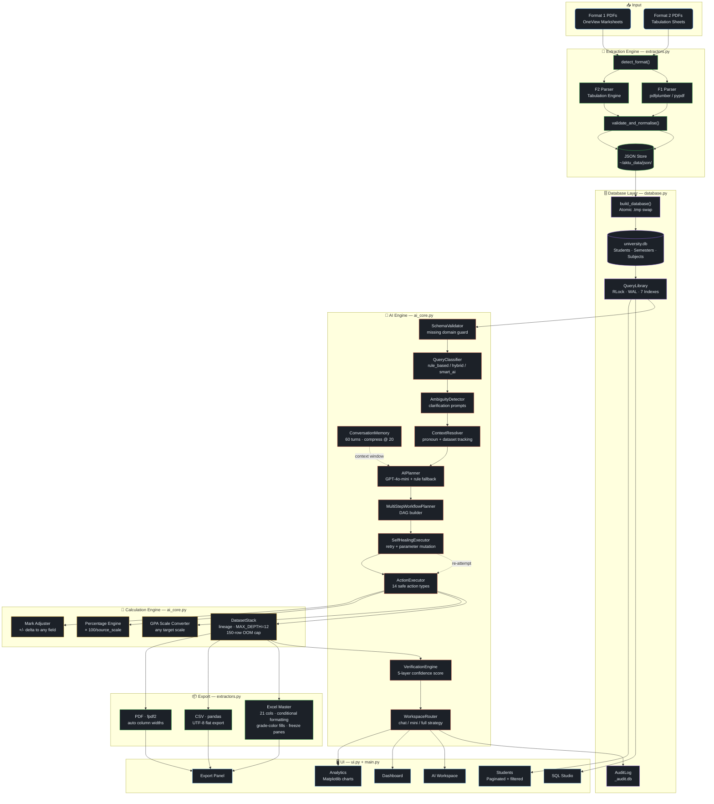
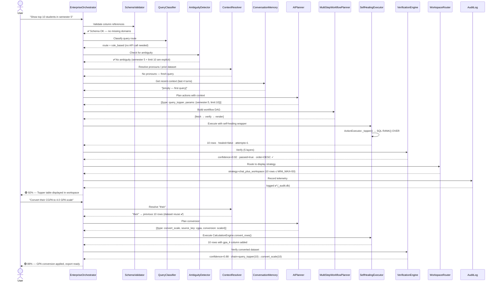
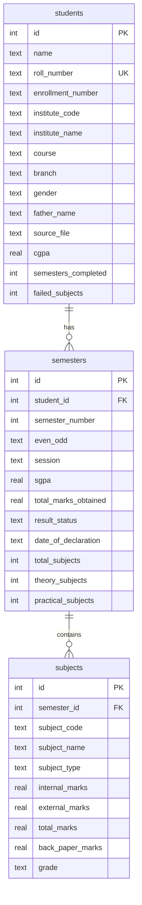
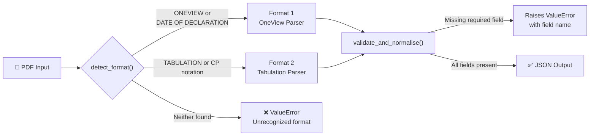
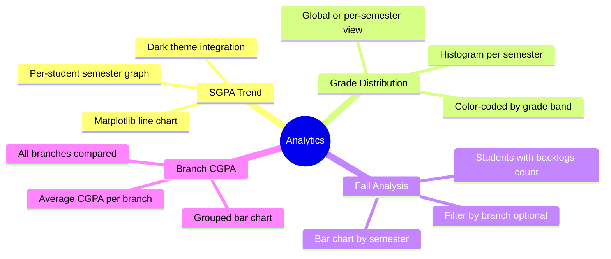
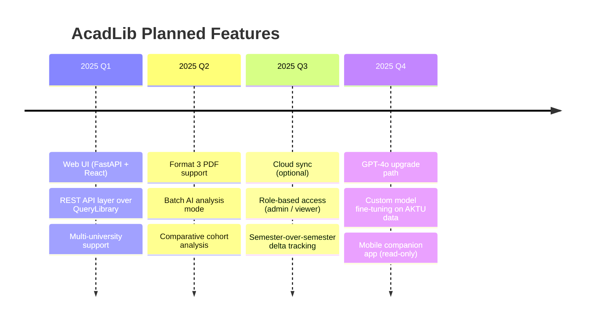

<div align="center">


<!-- Animated typing tagline -->


<br/><br/>

<!-- Badge row 1 -->
[](https://python.org)
[](https://sqlite.org)
[](https://openai.com)
[](https://langchain.com)
[](https://docs.python.org/3/library/tkinter.html)

<!-- Badge row 2 -->
[]()
[]()
[](https://github.com/NIKHILUTTAM/AcadLib)

<br/>

<!-- Animated stats strip -->
<table>
<tr>
<td align="center">
  
</td>
<td align="center">
  
</td>
<td align="center">
  
</td>
<td align="center">
  
</td>
<td align="center">
  
</td>
<td align="center">
  
</td>
</tr>
</table>

<br/>

<!-- Hero quote -->
<blockquote>
<p><strong>Turn fragmented university examination records into a live intelligence layer.</strong><br/>
AcadLib is a production-grade Python desktop application that ingests AKTU result PDFs,<br/>
builds a fully-indexed relational database, and exposes that data through natural language,<br/>
raw SQL, verified analytics, and exportable reports — all without writing a single line of code.</p>
</blockquote>

<!-- Animated wave divider -->


</div>

---

## 📖 Table of Contents

<details>
<summary><b>🗂 Click to expand the full Table of Contents</b></summary>

| # | Section | Description |
|:-:|---|---|
| 1 | [🌟 Why AcadLib?](#-why-acadlib) | Problem & solution comparison |
| 2 | [✨ Deep Feature Breakdown](#-deep-feature-breakdown) | All 10 panels & capabilities |
| 3 | [⚡ Data Pipeline](#-how-it-works--the-data-pipeline) | PDF → DB → AI flow |
| 4 | [🏗 System Architecture](#-system-architecture) | Full Mermaid flowchart |
| 5 | [🤖 AI Engine — 9 Components](#-the-ai-engine--9-components) | Orchestrator deep-dive |
| 6 | [🎭 AI Sequence Walkthrough](#-ai-sequence-walkthrough) | Step-by-step sequence diagram |
| 7 | [🖥 Live Demo Session](#-live-demo-session) | Real multi-step workflow |
| 8 | [🗄 Database Design](#-database-design) | Schema, indexes, ERD |
| 9 | [🎯 Confidence Scoring System](#-confidence-scoring-system) | Math behind the badges |
| 10 | [📥 PDF Extraction Engine](#-pdf-extraction-engine) | Dual-format parser details |
| 11 | [🧮 Calculation Engine](#-calculation-engine) | GPA conversion math |
| 12 | [📊 Analytics & Export](#-analytics--export) | Charts, Excel, CSV, PDF |
| 13 | [🔗 Dataset Lineage](#-dataset-lineage--provenance) | DatasetStack provenance |
| 14 | [💬 Query Reference Card](#-query-reference-card) | All supported queries |
| 15 | [🚀 Quick Start](#-quick-start) | Install & run |
| 16 | [⚙️ Configuration](#-configuration) | Settings & env vars |
| 17 | [📁 Project Structure](#-project-structure) | File tree explained |
| 18 | [📦 Technology Stack](#-technology-stack) | Full dependency table |
| 19 | [📈 Roadmap](#-roadmap) | Planned features |
| 20 | [🤝 Contributing](#-contributing) | How to contribute |
| 21 | [👨‍💻 Author](#-author) | Contact & links |

</details>

---

## 🌟 Why AcadLib?

Every semester, AKTU produces thousands of result records — buried in PDFs, locked inside examination portals, or scattered across spreadsheets. Querying this data means manual effort, fragile Excel formulas, or expensive proprietary software.

**AcadLib replaces all of that with a single desktop application.**

<!-- Animated SVG comparison banner -->
<div align="center">
<svg width="820" height="60" viewBox="0 0 820 60" xmlns="http://www.w3.org/2000/svg">
  <defs>
    <linearGradient id="grad1" x1="0%" y1="0%" x2="100%" y2="0%">
      <stop offset="0%" style="stop-color:#F85149;stop-opacity:0.15"/>
      <stop offset="50%" style="stop-color:#0F1117;stop-opacity:0.5"/>
      <stop offset="100%" style="stop-color:#238636;stop-opacity:0.15"/>
    </linearGradient>
  </defs>
  <rect width="820" height="60" rx="10" fill="url(#grad1)" stroke="#30363D" stroke-width="1"/>
  <text x="180" y="35" text-anchor="middle" font-family="Segoe UI, sans-serif" font-size="13" font-weight="bold" fill="#F85149">❌  Traditional Workflow</text>
  <text x="410" y="35" text-anchor="middle" font-size="22" fill="#388BFD">
    ⟶
    <animate attributeName="opacity" values="1;0.4;1" dur="2s" repeatCount="indefinite"/>
  </text>
  <text x="640" y="35" text-anchor="middle" font-family="Segoe UI, sans-serif" font-size="13" font-weight="bold" fill="#3FB950">✅  AcadLib Workflow</text>
</svg>
</div>

<br/>

<table>
<thead>
<tr>
<th width="45%">❌ Before AcadLib</th>
<th width="10%" align="center">→</th>
<th width="45%">✅ After AcadLib</th>
</tr>
</thead>
<tbody>
<tr>
<td>Download PDFs manually, rename, file, repeat every semester</td>
<td align="center">📄</td>
<td>Upload once — <code>process_batch_f1()</code> auto-extracts all records</td>
</tr>
<tr>
<td>Build Excel pivot tables and VLOOKUP chains by hand</td>
<td align="center">📊</td>
<td><code>Show branch-wise CGPA comparison</code> → instant results in workspace</td>
</tr>
<tr>
<td>Write SQL queries from scratch every time</td>
<td align="center">🔍</td>
<td>Natural language → AI planner → verified SQL → display</td>
</tr>
<tr>
<td>Static, re-generated reports that go stale</td>
<td align="center">📋</td>
<td>Live <code>DatasetStack</code> with full 12-frame provenance tracking</td>
</tr>
<tr>
<td>No audit trail or query history whatsoever</td>
<td align="center">🔐</td>
<td>Every query logged to <code>_audit.db</code> with route + confidence score</td>
</tr>
<tr>
<td>New semester = redo everything from scratch</td>
<td align="center">🔄</td>
<td>Format 2 merge logic: <code>updated / skipped / conflict / created</code></td>
</tr>
<tr>
<td>Siloed data, zero error checking, no validation</td>
<td align="center">🛡️</td>
<td>5-layer <code>VerificationEngine</code> + <code>SelfHealingExecutor</code></td>
</tr>
<tr>
<td>AI? No chance — students enter marks by hand</td>
<td align="center">🤖</td>
<td>GPT-4o-mini copilot with pronoun resolution + 60-turn memory</td>
</tr>
<tr>
<td>GPA conversions require manual formula work</td>
<td align="center">🧮</td>
<td><code>Convert their CGPA to 4.0 scale</code> → <code>CalculationEngine</code> in 1 step</td>
</tr>
<tr>
<td>Reports locked inside the system — no export path</td>
<td align="center">📦</td>
<td>Excel (21-col master), CSV (pandas), PDF (fpdf2) — one click</td>
</tr>
</tbody>
</table>

---

## ✨ Deep Feature Breakdown

<details open>
<summary><b>🏠 Dashboard Panel</b></summary>

The landing screen. Shows live counts from the database:
- Total students, total semesters, total subjects loaded
- Quick-action tiles for common workflows (upload, query, export)
- Refreshes automatically on navigation via `panel.refresh()`

</details>

<details>
<summary><b>📤 Upload F1 — OneView Marksheet Ingestion</b></summary>

**Purpose:** Batch-process individual student result PDFs (AKTU OneView format).

**Pipeline:**
1. User selects input directory — `process_batch_f1(input_dir, output_dir, progress_cb)`
2. Each PDF is opened with `pdfplumber` (fallback: `pypdf`)
3. `detect_format()` checks for `"ONEVIEW"` or `"DATE OF DECLARATION"` in text
4. `parse_student_header_f1()` extracts: institute code, course, roll number, enrollment, name, father's name, gender, branch
5. `split_semesters_f1()` splits text at `Semester: N  Even/Odd: Odd|Even` markers
6. `SUBJECT_RE_F1` regex parses every subject row: code, name, type, internal, external, back-paper, grade
7. `validate_and_normalise()` enforces required fields — raises `ValueError` on bad data
8. Result written to `~/aktu_data/json/{roll_number}.json`
9. Progress callback updates UI bar in real time

**Duplicate handling:** Best semester kept via total marks tiebreak (`ns > es` → prefer new).

</details>

<details>
<summary><b>📥 Upload F2 — Tabulation Sheet Ingestion</b></summary>

**Purpose:** Batch-import exam hall tabulation register PDFs (one sheet = one class, one semester).

**Pipeline:**
1. `detect_format()` checks for `"TABULATION"` or `"CP("` in text
2. Document-level headers parsed once: institute code, branch, course, semester number (from `FIRST/SECOND/...EIGHTH SEMESTER`)
3. Each student row: serial number, enrollment, marks columns, CP total, SGPA
4. Back-paper flags extracted per subject from `--` notation
5. `run_format2_update()` applies intelligent merge:

| Merge Result | Condition |
|---|---|
| `created` | New student not in JSON store |
| `updated` | Student found, new semester appended |
| `skipped` | Student found, semester already present + SGPA matches |
| `conflict` | SGPA mismatch — keeps existing, flags for review |

</details>

<details>
<summary><b>🗄️ Database Panel</b></summary>

Builds/rebuilds `university.db` from the JSON store via `AppState.rebuild_db()`:
- Atomic write: builds to `.tmp` file first, then renames to live path — **never corrupts existing DB**
- WAL journal mode + `PRAGMA synchronous=NORMAL` for crash safety
- Pre-computes `cgpa`, `failed_subjects`, `semesters_completed` at ingest time
- Live row count display post-build

</details>

<details>
<summary><b>👥 Students Panel</b></summary>

Paginated, filterable student table backed by `QueryLibrary.list_students_paginated()`:

**Filters available:**
- Text search (name or roll number — LIKE query)
- Branch dropdown (`get_all_branches()`)
- Session dropdown (`get_all_sessions()`)
- Year (`1st–4th Year`, `Alumni/Grad` — maps to `semesters_completed` ranges)
- CGPA bands (`≥ 9.0`, `≥ 8.0`, `≥ 7.0`, `≥ 6.0`, `< 6.0`)
- Fail status (`No Fails`, `Has Fails`)
- Sort column + direction
- Page size: configurable, default 100 rows per page

**Columns shown:** Name, Roll Number, Enrollment, Gender, Branch, CGPA

</details>

<details>
<summary><b>📊 Analytics Panel</b></summary>

Matplotlib-powered charts embedded via `FigureCanvasTkAgg`:
- **SGPA Trend** — semester-over-semester trend line per student
- **Grade Distribution** — histogram of grade bands per semester
- **Fail Analysis** — bar chart of students with backlogs by semester
- **Branch CGPA Comparison** — grouped bar chart across all branches

All charts rendered with the app's dark theme (`THEME["bg"]`, `THEME["card_bg"]`).

</details>

<details>
<summary><b>💬 AI Workspace (Chatbot Panel)</b></summary>

The conversational interface. Powered by `EnterpriseOrchestrator` — see [AI Engine](#-the-ai-engine--9-components) below.

Key behaviors:
- Pronoun resolution (`"their"`, `"those students"`, `"this report"` → reuses previous dataset)
- 60-turn rolling memory window, compresses every 20 turns to a summary string
- Ambiguity detection with structured clarification choices
- Schema validation before any SQL touches the DB — catches hallucinated columns
- Confidence badge (`🟢 / 🟡 / 🔴`) displayed with every response
- Three display strategies: `chat_inline` (≤10 rows), `chat_plus_workspace` (≤50), `workspace_only` (>50)

</details>

<details>
<summary><b>🧠 SQL Studio Panel</b></summary>

LangChain `create_sql_agent` (OpenAI Tools / Tool Calling):
- Schema injection into system prompt → zero hallucinated column names
- `top_k` tuned to dataset size: `max(n_students, min(n_subjects, 500))`
- Up to `max_iterations=15` per query
- Live schema introspection via `PRAGMA table_info`
- Intermediate steps captured via `return_intermediate_steps=True` — shown in UI
- Falls back from `openai-tools` to `tool-calling` agent type automatically

</details>

<details>
<summary><b>📦 Export Panel</b></summary>

Three export paths, all seeded from the current workspace dataset:

| Format | Engine | Features |
|---|---|---|
| **Excel** | `openpyxl` | 21-column master report, grade-color cell fills, conditional formatting, auto-filter, freeze panes, bold headers |
| **CSV** | `pandas` | Flat UTF-8 export, all columns, instant |
| **PDF** | `fpdf2` | Auto column widths, striped rows, header row, page breaks |

Export inherits from `state.last_exportable_dataset` — no re-query needed.

</details>

<details>
<summary><b>⚙️ Settings Panel</b></summary>

Persisted to `~/aktu_data/settings.json` via `AppState.save_settings()`:
- JSON input directory path
- SQLite DB path
- Export output directory
- OpenAI API key (for AI Workspace + SQL Studio)
- Model selection (default: `gpt-4o-mini`)

</details>

---

## ⚡ How It Works — The Data Pipeline

```
╔═════════════════════════════════════════════════════════════════════════════╗
║                        ACADLIB DATA PIPELINE                               ║
╠═════════════════════════════════════════════════════════════════════════════╣
║                                                                             ║
║   📄 University Result PDFs (AKTU — Format 1 or Format 2)                  ║
║          │                                                                  ║
║          ▼                                                                  ║
║   ┌──────────────────────┐                                                  ║
║   │   detect_format()    │──── "ONEVIEW" or "DATE OF DECLARATION"?          ║
║   │   (keyword scanner)  │──── "TABULATION" or "CP(" found?                ║
║   └──────────────────────┘                                                  ║
║          │                                                                  ║
║    ┌─────┴──────────────────────┐                                           ║
║    ▼                           ▼                                            ║
║  ┌───────────────────┐  ┌──────────────────────────────┐                   ║
║  │   F1 Parser       │  │   F2 Parser                  │                   ║
║  │  pdfplumber /     │  │  Tabulation + CP notation    │                   ║
║  │  pypdf fallback   │  │  Back-paper flag extraction  │                   ║
║  │  Regex header     │  │  Batch row iteration         │                   ║
║  │  Semester split   │  │  Semester: FIRST..EIGHTH     │                   ║
║  │  SUBJECT_RE_F1    │  │  merge: updated/created/skip │                   ║
║  └───────────────────┘  └──────────────────────────────┘                   ║
║          │                           │                                      ║
║          └─────────────┬─────────────┘                                      ║
║                        ▼                                                    ║
║               ┌─────────────────────┐                                      ║
║               │ validate_and_       │  Raises ValueError on:               ║
║               │ normalise()         │  • missing student_name              ║
║               │                     │  • missing roll_number               ║
║               │                     │  • missing semesters list            ║
║               └─────────────────────┘                                      ║
║                        │                                                    ║
║                        ▼                                                    ║
║               ┌─────────────────────┐                                      ║
║               │   JSON Store        │  ~/aktu_data/json/                   ║
║               │  {roll_number}.json │  One file per student                ║
║               └─────────────────────┘                                      ║
║                        │                                                    ║
║                        ▼                                                    ║
║       ┌────────────────────────────────────────┐                           ║
║       │          build_database()               │                           ║
║       │  JSON → students + semesters + subjects │                           ║
║       │  Atomic write: .tmp swap (crash-safe)   │                           ║
║       │  Pre-compute: cgpa / failed / sem_count │                           ║
║       └────────────────────────────────────────┘                           ║
║                        │                                                    ║
║                        ▼                                                    ║
║           ┌────────────────────────────────┐                               ║
║           │     university.db              │                               ║
║           │  WAL · 7 Indexes · Thread-safe │                               ║
║           │  RLock · FK integrity · NOCASE │                               ║
║           └────────────────────────────────┘                               ║
║                        │                                                    ║
║        ┌───────────────┼───────────────────┐                               ║
║        ▼               ▼                   ▼                               ║
║  ┌───────────┐  ┌────────────────┐  ┌────────────────┐                    ║
║  │AI Workspace│  │  SQL Studio    │  │ Analytics &    │                    ║
║  │ NL → SQL  │  │ LangChain Agent│  │ Export Engine  │                    ║
║  └───────────┘  └────────────────┘  └────────────────┘                    ║
║                                                                             ║
╚═════════════════════════════════════════════════════════════════════════════╝
```

---

## 🏗 System Architecture



---

## 🤖 The AI Engine — 9 Components

The AI system in `ai_core.py` is **not a monolithic chatbot**. It is a multi-stage orchestration pipeline with independently testable, composable components.

<!-- Animated pipeline SVG -->
<div align="center">
<svg width="820" height="110" viewBox="0 0 820 110" xmlns="http://www.w3.org/2000/svg">
  <defs>
    <linearGradient id="pipeGrad" x1="0%" y1="0%" x2="100%" y2="0%">
      <stop offset="0%" style="stop-color:#0D3B6E;stop-opacity:0.5"/>
      <stop offset="100%" style="stop-color:#238636;stop-opacity:0.5"/>
    </linearGradient>
  </defs>
  <rect width="820" height="110" rx="12" fill="#0F1117" stroke="#30363D" stroke-width="1"/>
  <!-- Boxes -->
  <rect x="10"  y="35" width="72" height="38" rx="6" fill="#0D2137" stroke="#388BFD" stroke-width="1.5"/>
  <rect x="100" y="35" width="72" height="38" rx="6" fill="#0D2137" stroke="#A371F7" stroke-width="1.5"/>
  <rect x="190" y="35" width="72" height="38" rx="6" fill="#0D2137" stroke="#F78166" stroke-width="1.5"/>
  <rect x="280" y="35" width="72" height="38" rx="6" fill="#0D2137" stroke="#D29922" stroke-width="1.5"/>
  <rect x="370" y="35" width="72" height="38" rx="6" fill="#0D2137" stroke="#388BFD" stroke-width="1.5"/>
  <rect x="460" y="35" width="72" height="38" rx="6" fill="#0D2137" stroke="#F78166" stroke-width="1.5"/>
  <rect x="550" y="35" width="72" height="38" rx="6" fill="#0D2137" stroke="#3FB950" stroke-width="1.5"/>
  <rect x="640" y="35" width="72" height="38" rx="6" fill="#0D2137" stroke="#56D364" stroke-width="1.5"/>
  <rect x="730" y="35" width="72" height="38" rx="6" fill="#0D2137" stroke="#79C0FF" stroke-width="1.5"/>
  <!-- Labels -->
  <text x="46"  y="52" text-anchor="middle" font-family="monospace" font-size="10" font-weight="600" fill="#79C0FF">Schema</text>
  <text x="46"  y="65" text-anchor="middle" font-family="monospace" font-size="10" font-weight="600" fill="#79C0FF">Valid.</text>
  <text x="136" y="52" text-anchor="middle" font-family="monospace" font-size="10" font-weight="600" fill="#C9A9FF">Query</text>
  <text x="136" y="65" text-anchor="middle" font-family="monospace" font-size="10" font-weight="600" fill="#C9A9FF">Classify</text>
  <text x="226" y="52" text-anchor="middle" font-family="monospace" font-size="10" font-weight="600" fill="#FFAA8A">Ambiguity</text>
  <text x="226" y="65" text-anchor="middle" font-family="monospace" font-size="10" font-weight="600" fill="#FFAA8A">Detect</text>
  <text x="316" y="52" text-anchor="middle" font-family="monospace" font-size="10" font-weight="600" fill="#E3B341">Context</text>
  <text x="316" y="65" text-anchor="middle" font-family="monospace" font-size="10" font-weight="600" fill="#E3B341">Resolve</text>
  <text x="406" y="52" text-anchor="middle" font-family="monospace" font-size="10" font-weight="600" fill="#79C0FF">AI</text>
  <text x="406" y="65" text-anchor="middle" font-family="monospace" font-size="10" font-weight="600" fill="#79C0FF">Planner</text>
  <text x="496" y="52" text-anchor="middle" font-family="monospace" font-size="10" font-weight="600" fill="#FFAA8A">Self-Heal</text>
  <text x="496" y="65" text-anchor="middle" font-family="monospace" font-size="10" font-weight="600" fill="#FFAA8A">Executor</text>
  <text x="586" y="52" text-anchor="middle" font-family="monospace" font-size="10" font-weight="600" fill="#56D364">Verify</text>
  <text x="586" y="65" text-anchor="middle" font-family="monospace" font-size="10" font-weight="600" fill="#56D364">Engine</text>
  <text x="676" y="52" text-anchor="middle" font-family="monospace" font-size="10" font-weight="600" fill="#79C0FF">Workspace</text>
  <text x="676" y="65" text-anchor="middle" font-family="monospace" font-size="10" font-weight="600" fill="#79C0FF">Router</text>
  <text x="766" y="52" text-anchor="middle" font-family="monospace" font-size="10" font-weight="600" fill="#9ED1FF">Audit</text>
  <text x="766" y="65" text-anchor="middle" font-family="monospace" font-size="10" font-weight="600" fill="#9ED1FF">Log</text>
  <!-- Animated flow arrows -->
  <line x1="82"  y1="54" x2="98"  y2="54" stroke="#388BFD" stroke-width="2" stroke-dasharray="8 4">
    <animate attributeName="stroke-dashoffset" from="12" to="0" dur="1.2s" repeatCount="indefinite"/>
  </line>
  <line x1="172" y1="54" x2="188" y2="54" stroke="#A371F7" stroke-width="2" stroke-dasharray="8 4">
    <animate attributeName="stroke-dashoffset" from="12" to="0" dur="1.2s" repeatCount="indefinite"/>
  </line>
  <line x1="262" y1="54" x2="278" y2="54" stroke="#F78166" stroke-width="2" stroke-dasharray="8 4">
    <animate attributeName="stroke-dashoffset" from="12" to="0" dur="1.2s" repeatCount="indefinite"/>
  </line>
  <line x1="352" y1="54" x2="368" y2="54" stroke="#D29922" stroke-width="2" stroke-dasharray="8 4">
    <animate attributeName="stroke-dashoffset" from="12" to="0" dur="1.2s" repeatCount="indefinite"/>
  </line>
  <line x1="442" y1="54" x2="458" y2="54" stroke="#388BFD" stroke-width="2" stroke-dasharray="8 4">
    <animate attributeName="stroke-dashoffset" from="12" to="0" dur="1.2s" repeatCount="indefinite"/>
  </line>
  <line x1="532" y1="54" x2="548" y2="54" stroke="#F78166" stroke-width="2" stroke-dasharray="8 4">
    <animate attributeName="stroke-dashoffset" from="12" to="0" dur="1.2s" repeatCount="indefinite"/>
  </line>
  <line x1="622" y1="54" x2="638" y2="54" stroke="#3FB950" stroke-width="2" stroke-dasharray="8 4">
    <animate attributeName="stroke-dashoffset" from="12" to="0" dur="1.2s" repeatCount="indefinite"/>
  </line>
  <line x1="712" y1="54" x2="728" y2="54" stroke="#56D364" stroke-width="2" stroke-dasharray="8 4">
    <animate attributeName="stroke-dashoffset" from="12" to="0" dur="1.2s" repeatCount="indefinite"/>
  </line>
  <!-- Bottom label -->
  <text x="410" y="100" text-anchor="middle" font-family="Segoe UI" font-size="11" fill="#7D8590">EnterpriseOrchestrator — ai_core.py</text>
</svg>
</div>

<br/>

<table>
<tr>
<td width="50%" valign="top">

### 🔵 `SchemaValidator`
Guards against hallucinated column references and out-of-scope queries.

Blocks requests for: placement records, attendance, salary, hostel fees, internship data, company placements — returns a precise error message before any SQL is run.

Company name detection uses a compiled regex across 18+ major companies.

```python
_MISSING_DOMAINS = {
    r'\b(placement|placed)\b': "Placement data not available.",
    r'\b(attendance|absent)\b': "Attendance not tracked.",
    r'\b(salary|package|lpa)\b':  "Salary not available.",
    ...
}
```

</td>
<td width="50%" valign="top">

### 🟣 `QueryClassifier`
Maps each query to one of three execution pipelines — determines cost before any API call:

| Route | Trigger | API Call? |
|---|---|---|
| `rule_based` | Keyword match | ❌ No |
| `hybrid` | Rule + verification needed | ⚡ Sometimes |
| `smart_ai` | Complex / open-ended | ✅ Yes |

Hybrid triggers: `topper + explain`, `fetch + compare`, `convert + cgpa`, multi-clause patterns.

</td>
</tr>
<tr>
<td width="50%" valign="top">

### 🟠 `AmbiguityDetector`
Intercepts queries with multiple valid interpretations before SQL executes.

```
"Show best student" → asks:
  ✦ By CGPA
  ✦ By SGPA
  ✦ By improvement
  ✦ By fewest fails
```

Four compiled regex patterns cover: `best/top student`, `good/poor students`, `compare` without qualifier.

</td>
<td width="50%" valign="top">

### 🟡 `ContextResolver`
Resolves ambiguous pronouns across multi-turn conversations:

```
"their" / "them" / "those students"
"previous result" / "last result"
"this report" / "these students"
```

Regex compiled at module load. Injects `state.last_rows` directly into next action — **zero extra DB hit**. Also detects scale conversion requests: `"scale of 4"`, `"to percentage"`, `"GPA 10"`.

</td>
</tr>
<tr>
<td width="50%" valign="top">

### 🔵 `AIPlanner` — GPT-4o-mini Intent Parser
Converts natural language to a structured JSON action plan:

```json
{
  "message": "Fetching top 10 in Semester 5...",
  "actions": [
    {
      "type": "query_topper",
      "params": { "semester": 5, "limit": 10 }
    }
  ]
}
```

System prompt includes: full DB schema, student count, subject count, last 4 conversation turns, last known student + semester. Falls back to `_rule_based()` on OpenAI failure.

</td>
<td width="50%" valign="top">

### 🟠 `SelfHealingExecutor`
Wraps `ActionExecutor` in a retry loop. On failure:
1. Logs the error
2. Mutates action parameters (relaxes filters, broadens scope)
3. Re-attempts execution
4. Sets `healed=True` and increments `attempts`

Both flags are applied as penalties in `ExecutionReport.confidence()`:
- `healed=True` → `-0.05`
- `attempts > 2` → `-0.05`

**14 safe action types** enforced via `SAFE_ACTIONS` set — unknown action types are rejected silently.

</td>
</tr>
<tr>
<td width="50%" valign="top">

### 🟢 `VerificationEngine`
5-layer weighted confidence scoring:

```python
WEIGHTS = {
    "rows_fetched":   0.25,
    "rows_rendered":  0.20,
    "calculation_ok": 0.20,
    "route_ok":       0.20,
    "context_ok":     0.15
}
```

Also checks: sort order correctness (`check_order_key` with ASC/DESC), row count vs expected, partial render detection.

</td>
<td width="50%" valign="top">

### 🔵 `WorkspaceRouter`
Routes results to the right display strategy:

| Strategy | Condition | Chat? | Workspace? |
|---|---|---|---|
| `chat_inline` | ≤ 10 rows | ✅ | ❌ |
| `chat_plus_workspace` | ≤ 50 rows | ✅ | ✅ |
| `workspace_only` | > 50 rows | ❌ | ✅ |
| `profile_workspace` | `student_profile` action | ✅ | ✅ |
| `chart_workspace` | `show_chart` / `grade_dist` | ✅ | ✅ |

</td>
</tr>
<tr>
<td width="50%" valign="top">

### 🟣 `ConversationMemory`
Rolling 60-turn memory with automatic compression:
- Stores: role, content, action_type, timestamp per turn
- Compresses every 20 turns into a summary string
- Tracks `workflow_success_rate()` across the session
- Stores `_workflow_history` — last 100 workflow outcomes

</td>
<td width="50%" valign="top">

### ⚫ `AuditLog` — Persistent Observability
Every `orchestrator.run()` writes to `_audit.db`:

| Column | Type | Notes |
|---|---|---|
| `timestamp` | TEXT | ISO 8601 |
| `query` | TEXT | Raw user input |
| `route` | TEXT | rule_based / smart_ai |
| `execution_ms` | REAL | Wall time |
| `rows_returned` | INT | Rows fetched |
| `confidence` | REAL | 0.0 – 1.0 |
| `status` | TEXT | ok / error |
| `error` | TEXT | Error message if any |

</td>
</tr>
</table>

---

## 🎭 AI Sequence Walkthrough



---

## 🖥 Live Demo Session

> A real multi-step workflow: top 10 → GPA conversion → export

```
╔══════════════════════════════════════════════════════════════════════════════╗
║  AcadLib  ·  AI Workspace  ·  Session #1                                   ║
╠══════════════════════════════════════════════════════════════════════════════╣
║                                                                              ║
║  You:  Show top 10 students in semester 5                                   ║
║                                                                              ║
║  ┌─ AcadLib ──────────────────────────────────────────────────────────────┐ ║
║  │  Route: rule_based · Action: query_topper · Sem: 5 · Limit: 10        │ ║
║  │  SQL: SELECT RANK() OVER (ORDER BY sgpa DESC) ...                     │ ║
║  │                                                                         │ ║
║  │  RANK  NAME               ROLL         BRANCH   SGPA    STATUS        │ ║
║  │  ────  ─────────────────  ───────────  ───────  ──────  ──────────    │ ║
║  │    1   Ananya Sharma      2100140001   CS        9.82   PASS          │ ║
║  │    2   Rohan Mehta        2100140012   CS        9.74   PASS          │ ║
║  │    3   Priya Gupta        2100130008   ECE       9.71   PASS          │ ║
║  │    4   Aditya Verma       2100150003   ME        9.65   PASS          │ ║
║  │    5   Kavya Nair         2100140021   CS        9.58   PASS          │ ║
║  │   ...  (5 more rows)                                                   │ ║
║  │                                                                         │ ║
║  │  🟢 92% · 10 rows · 48ms                                              │ ║
║  └─────────────────────────────────────────────────────────────────────────┘ ║
║                                                                              ║
║  You:  Convert their CGPA to 4.0 GPA scale                                 ║
║                                                                              ║
║  ┌─ AcadLib ──────────────────────────────────────────────────────────────┐ ║
║  │  ContextResolver: "their" → previous 10 rows ✅ (no DB hit)           │ ║
║  │  CalculationEngine: gpa_4 = round(cgpa / 10.0 * 4.0, 3)              │ ║
║  │  Provenance chain: query_topper(10) → convert_scale(10)               │ ║
║  │                                                                         │ ║
║  │  NAME               CGPA    SGPA(5)   GPA(4.0)                        │ ║
║  │  ─────────────────  ──────  ────────  ────────                        │ ║
║  │  Ananya Sharma       9.47    9.82        3.79                          │ ║
║  │  Rohan Mehta         9.31    9.74        3.72                          │ ║
║  │  Priya Gupta         9.28    9.71        3.71                          │ ║
║  │   ...  (7 more rows)                                                   │ ║
║  │                                                                         │ ║
║  │  🟢 88% · conversion applied · 0 extra DB queries · 61ms              │ ║
║  └─────────────────────────────────────────────────────────────────────────┘ ║
║                                                                              ║
║  You:  Export this report as Excel                                          ║
║                                                                              ║
║  ┌─ AcadLib ──────────────────────────────────────────────────────────────┐ ║
║  │  ContextResolver: "this report" → last_exportable_dataset ✅           │ ║
║  │  DataExporter.to_excel_master()                                         │ ║
║  │  → 21 cols · grade-color fills · freeze panes · auto-filter            │ ║
║  │  → ~/aktu_data/exports/top_10_sem5_gpa4.xlsx                          │ ║
║  │  ✅ Export complete in 340ms                                            │ ║
║  └─────────────────────────────────────────────────────────────────────────┘ ║
║                                                                              ║
╚══════════════════════════════════════════════════════════════════════════════╝
```

---

## 🗄 Database Design



### 📇 Index Reference Table

| Index Name | Table | Column | Query Pattern Served |
|---|---|---|---|
| `idx_students_name` | `students` | `name COLLATE NOCASE` | `WHERE name LIKE ?` full-text search |
| `idx_students_cgpa` | `students` | `cgpa` | `ORDER BY cgpa DESC` ranking queries |
| `idx_students_fails` | `students` | `failed_subjects` | Fail report filter `> 0` |
| `idx_semesters_student_id` | `semesters` | `student_id` | JOIN students → semesters |
| `idx_semesters_sem_num` | `semesters` | `semester_number` | `WHERE semester_number = ?` |
| `idx_subjects_semester_id` | `subjects` | `semester_id` | JOIN semesters → subjects |
| `idx_subjects_grade` | `subjects` | `grade` | Grade distribution queries |

### 🎨 Grade Color System

<div align="center">

| Grade | Color | Hex | Meaning |
|:---:|:---:|:---:|---|
| **A+** | 🟢 | `#3FB950` | Outstanding (≥ 90%) |
| **A** | 🟩 | `#56D364` | Excellent (≥ 80%) |
| **B+** | 🔵 | `#388BFD` | Very Good (≥ 70%) |
| **B** | 🩵 | `#79C0FF` | Good (≥ 60%) |
| **C** | 🟡 | `#E3B341` | Average (≥ 50%) |
| **D** | 🟠 | `#D29922` | Below Average (≥ 40%) |
| **E** | 🔴 | `#F85149` | Fail |
| **E#** | 🔴 | `#DA3633` | Fail — Back Paper |
| **F** | ⬛ | `#8B0000` | Absent / Withheld |

</div>

<!-- Grade distribution animated bar chart SVG -->
<div align="center">
<br/>
<svg width="700" height="180" viewBox="0 0 700 180" xmlns="http://www.w3.org/2000/svg">
  <rect width="700" height="180" rx="10" fill="#0F1117" stroke="#30363D"/>
  <text x="350" y="22" text-anchor="middle" font-family="Segoe UI" font-size="12" font-weight="bold" fill="#7D8590">Typical Grade Distribution (illustrative)</text>
  <!-- Bars with SVG animate (height + y grow from baseline=155) -->
  <rect x="50"  y="125" width="52" height="30"  rx="4" fill="#3FB950">
    <animate attributeName="height" from="0" to="30"  dur="0.6s" begin="0.0s" fill="freeze"/>
    <animate attributeName="y"      from="155" to="125" dur="0.6s" begin="0.0s" fill="freeze"/>
  </rect>
  <rect x="120" y="75"  width="52" height="80"  rx="4" fill="#56D364">
    <animate attributeName="height" from="0" to="80"  dur="0.6s" begin="0.1s" fill="freeze"/>
    <animate attributeName="y"      from="155" to="75"  dur="0.6s" begin="0.1s" fill="freeze"/>
  </rect>
  <rect x="190" y="55"  width="52" height="100" rx="4" fill="#388BFD">
    <animate attributeName="height" from="0" to="100" dur="0.6s" begin="0.2s" fill="freeze"/>
    <animate attributeName="y"      from="155" to="55"  dur="0.6s" begin="0.2s" fill="freeze"/>
  </rect>
  <rect x="260" y="85"  width="52" height="70"  rx="4" fill="#79C0FF">
    <animate attributeName="height" from="0" to="70"  dur="0.6s" begin="0.3s" fill="freeze"/>
    <animate attributeName="y"      from="155" to="85"  dur="0.6s" begin="0.3s" fill="freeze"/>
  </rect>
  <rect x="330" y="100" width="52" height="55"  rx="4" fill="#E3B341">
    <animate attributeName="height" from="0" to="55"  dur="0.6s" begin="0.4s" fill="freeze"/>
    <animate attributeName="y"      from="155" to="100" dur="0.6s" begin="0.4s" fill="freeze"/>
  </rect>
  <rect x="400" y="120" width="52" height="35"  rx="4" fill="#D29922">
    <animate attributeName="height" from="0" to="35"  dur="0.6s" begin="0.5s" fill="freeze"/>
    <animate attributeName="y"      from="155" to="120" dur="0.6s" begin="0.5s" fill="freeze"/>
  </rect>
  <rect x="470" y="130" width="52" height="25"  rx="4" fill="#F85149">
    <animate attributeName="height" from="0" to="25"  dur="0.6s" begin="0.6s" fill="freeze"/>
    <animate attributeName="y"      from="155" to="130" dur="0.6s" begin="0.6s" fill="freeze"/>
  </rect>
  <rect x="540" y="140" width="52" height="15"  rx="4" fill="#DA3633">
    <animate attributeName="height" from="0" to="15"  dur="0.6s" begin="0.7s" fill="freeze"/>
    <animate attributeName="y"      from="155" to="140" dur="0.6s" begin="0.7s" fill="freeze"/>
  </rect>
  <!-- X-axis labels -->
  <text x="76"  y="168" text-anchor="middle" font-family="monospace" font-size="11" font-weight="bold" fill="#3FB950">A+</text>
  <text x="146" y="168" text-anchor="middle" font-family="monospace" font-size="11" font-weight="bold" fill="#56D364">A</text>
  <text x="216" y="168" text-anchor="middle" font-family="monospace" font-size="11" font-weight="bold" fill="#388BFD">B+</text>
  <text x="286" y="168" text-anchor="middle" font-family="monospace" font-size="11" font-weight="bold" fill="#79C0FF">B</text>
  <text x="356" y="168" text-anchor="middle" font-family="monospace" font-size="11" font-weight="bold" fill="#E3B341">C</text>
  <text x="426" y="168" text-anchor="middle" font-family="monospace" font-size="11" font-weight="bold" fill="#D29922">D</text>
  <text x="496" y="168" text-anchor="middle" font-family="monospace" font-size="11" font-weight="bold" fill="#F85149">E</text>
  <text x="566" y="168" text-anchor="middle" font-family="monospace" font-size="11" font-weight="bold" fill="#DA3633">E#</text>
</svg>

</div>

---

## 🎯 Confidence Scoring System

Every result goes through `ExecutionReport.confidence()` — a deterministic mathematical formula with weighted checks and penalties.

### Base Score Formula

```python
# Five binary checks, each worth 0.20 (max score = 1.0)
checks = [sql_ok, verification_ok, calculation_ok, workspace_ok, context_resolved]
confidence = sum(0.20 for check in checks if check)

# Penalty phase (applied after base score)
if healed:           confidence -= 0.05     # SelfHealingExecutor was triggered
if attempts > 2:     confidence -= 0.05     # Required more than 2 execution attempts
if error:            confidence  = c * 0.30 # Error occurred — severe penalty (70% cut)
if rows == 0 and not error:
    confidence = max(confidence, 0.50)      # Empty result is not necessarily wrong

# Clamp to [0.0, 1.0]
confidence = round(min(max(confidence, 0.0), 1.0), 3)
```

### VerificationEngine Weighted Scoring

```python
WEIGHTS = {
    "rows_fetched":   0.25,   # Was any data returned?
    "rows_rendered":  0.20,   # Were all rows displayed? (partial render = penalty)
    "calculation_ok": 0.20,   # Did calculations succeed?
    "route_ok":       0.20,   # Was the correct route used?
    "context_ok":     0.15    # Was context (pronouns) resolved correctly?
}
```

### Badge Thresholds

<!-- Animated confidence meter SVG -->
<div align="center">
<svg width="640" height="80" viewBox="0 0 640 80" xmlns="http://www.w3.org/2000/svg">
  <defs>
    <linearGradient id="meterGrad" x1="0%" y1="0%" x2="100%" y2="0%">
      <stop offset="0%"   style="stop-color:#F85149"/>
      <stop offset="40%"  style="stop-color:#F85149"/>
      <stop offset="40%"  style="stop-color:#D29922"/>
      <stop offset="70%"  style="stop-color:#D29922"/>
      <stop offset="70%"  style="stop-color:#3FB950"/>
      <stop offset="100%" style="stop-color:#3FB950"/>
    </linearGradient>
  </defs>
  <rect width="640" height="80" rx="10" fill="#0F1117" stroke="#30363D"/>
  <rect x="30" y="28" width="580" height="20" rx="10" fill="#21262D"/>
  <rect x="30" y="28" width="0" height="20" rx="10" fill="url(#meterGrad)">
    <animate attributeName="width" from="0" to="580" dur="1.5s" fill="freeze"/>
  </rect>
  <!-- Threshold markers -->
  <line x1="262" y1="20" x2="262" y2="55" stroke="#E6EDF3" stroke-width="1.5" stroke-dasharray="3 2"/>
  <line x1="436" y1="20" x2="436" y2="55" stroke="#E6EDF3" stroke-width="1.5" stroke-dasharray="3 2"/>
  <!-- Labels -->
  <text x="150" y="66" text-anchor="middle" font-family="monospace" font-size="11" fill="#F85149">🔴 Low  (&lt;0.70)</text>
  <text x="349" y="66" text-anchor="middle" font-family="monospace" font-size="11" fill="#D29922">🟡 Moderate (0.70–0.89)</text>
  <text x="535" y="66" text-anchor="middle" font-family="monospace" font-size="11" fill="#3FB950">🟢 High (≥0.90)</text>
  <text x="262" y="17" text-anchor="middle" font-family="monospace" font-size="10" fill="#7D8590">0.70</text>
  <text x="436" y="17" text-anchor="middle" font-family="monospace" font-size="10" fill="#7D8590">0.90</text>
</svg>
</div>

<br/>

| Badge | Range | Interpretation | Recommended Action |
|:---:|---|---|---|
| 🟢 | ≥ 0.90 | High confidence — all checks passed | Trust and use the result |
| 🟡 | 0.70 – 0.89 | Moderate — minor issues detected | Review before exporting |
| 🔴 | < 0.70 | Low — significant issues or errors | Rephrase or verify manually |

**Special case — Schema Rejection:** When `SchemaValidator` blocks a query, `schema_rejected=True` forces confidence to `0.93` — the query was handled cleanly, which is high-confidence behavior.

---

## 📥 PDF Extraction Engine

### Format Detection



<details open>
<summary><b>📋 Format 1 — OneView Marksheets</b></summary>

**Subject row regex** (compiled at module load for performance):
```python
SUBJECT_RE_F1 = re.compile(
    r'^([A-Z]{2,5}\d{3,4}[A-Z]?)'  # Subject code: BCE501, KCS401, etc.
    r'\s+(.*?)'                      # Subject name (greedy, trimmed)
    r'\s+(Theory|Practical|CA)'     # Subject type
    r'\s+(\d{1,3}|--)'              # Internal marks (-- = null, not zero)
    r'\s+(\d{1,3}\*?|--)'           # External marks (* = back paper)
    r'\s*(?:(\d{1,3}\*?|--)\s*)?'  # Back paper marks (optional column)
    r'([A-Z][+#]?|--)?\s*$',        # Grade: A+, B, E#, F, --
    re.IGNORECASE
)
```

**Header extraction** — 8 named-group regex patterns:

| Field | Pattern Type | Notes |
|---|---|---|
| `institute_code` | `\(\d+\)` | 3-digit code in parentheses |
| `course` | `B\.TECH\|M\.TECH\|MBA\|MCA` | Course code from line |
| `roll_number` | `RollNo\s*:\s*(\S+)` | Alphanumeric |
| `enrollment_number` | `EnrollmentNo\s*:\s*(\S+)` | 13-digit |
| `student_name` | `Name\s*:\s*([A-Z ]{5,40})` | Uppercase, trimmed |
| `father_name` | `Father'?s?\s*Name` | Optional possessive |
| `gender` | After father's name | `M` or `F` |
| `branch` | `Branch Code.*\(\d+\)` | Multi-word, cleaned |

**Semester split** — finds all `Semester: N  Even/Odd: (Odd|Even)` markers, slices text into blocks. Session extracted by looking **backward** from each marker.

**Duplicate semester handling:** When two records have the same `semester_number`, the one with higher `total_marks_obtained` is kept. Tiebreak: prefer `PASS` status.

</details>

<details>
<summary><b>📋 Format 2 — Tabulation Sheets (Batch)</b></summary>

One PDF = one semester, one class. Header fields are document-level, read once:

```
BACHELOR OF TECHNOLOGY — THIRD SEMESTER EXAM 2023-24
NAME OF INSTITUTE: 045  ABC Engineering College
Branch: Computer Science and Engineering
```

**Student rows** are identified by: `\d{1,3}\s+\d{13}` (serial + enrollment) + a subject code pattern.

**CP notation parsing:** `CP( 42)` → credit points → used to derive result status.

**Marks columns:** Dynamically mapped from subject headers at top of each column block. `--` parsed as `None` (not zero). Back-paper flags applied per-subject.

**Merge result codes** from `run_format2_update()`:

```python
merge_results = {
    "created":   [],   # New student — JSON file created
    "updated":   [],   # Existing student — new semester appended
    "skipped":   [],   # Semester already present, SGPA matches
    "conflict":  [],   # SGPA mismatch — existing preserved, flagged
    "error":     []    # Parse or write failure
}
```

</details>

---

## 🧮 Calculation Engine

All conversions in `CalculationEngine` are pure functions — no state, fully testable:

```python
# GPA Scale Conversion (10-point → target)
convert_to_scale(val, target_scale, source_scale=10.0)
    → round(val / source_scale * target_scale, 3)

# Shorthand helpers
convert_10_to_4(val)     → round(val / 10.0 * 4.0, 3)
convert_10_to_5(val)     → round(val / 10.0 * 5.0, 3)
to_percentage(val)       → round(val * (100.0 / 10.0), 2)

# Bulk row conversion
convert_rows(rows, source_key, conversion, target_scale)
    → applies formula to each row, appends new column

# Mark adjustment
adjust_marks(rows, amount, source_key)
    → adds `amount` (positive or negative) to each row's field
```

### Scale Conversion Chart

<!-- SVG scale conversion comparison -->
<div align="center">
<svg width="640" height="130" viewBox="0 0 640 130" xmlns="http://www.w3.org/2000/svg">
  <rect width="640" height="130" rx="10" fill="#0F1117" stroke="#30363D"/>
  <text x="320" y="22" text-anchor="middle" font-family="Segoe UI" font-size="12" font-weight="bold" fill="#7D8590">GPA Scale Conversion Examples</text>
  <!-- Headers -->
  <text x="80"  y="45" text-anchor="middle" font-family="monospace" font-size="11" fill="#79C0FF" font-weight="bold">CGPA (10pt)</text>
  <text x="220" y="45" text-anchor="middle" font-family="monospace" font-size="11" fill="#3FB950" font-weight="bold">GPA (4.0)</text>
  <text x="360" y="45" text-anchor="middle" font-family="monospace" font-size="11" fill="#A371F7" font-weight="bold">GPA (5.0)</text>
  <text x="500" y="45" text-anchor="middle" font-family="monospace" font-size="11" fill="#D29922" font-weight="bold">Percentage</text>
  <!-- Row 1 — fade in via SVG animate -->
  <text x="80"  y="70" text-anchor="middle" font-family="monospace" font-size="13" fill="#E6EDF3" opacity="0">9.82
    <animate attributeName="opacity" from="0" to="1" dur="0.5s" begin="0.1s" fill="freeze"/>
  </text>
  <text x="220" y="70" text-anchor="middle" font-family="monospace" font-size="13" fill="#3FB950" opacity="0">3.928
    <animate attributeName="opacity" from="0" to="1" dur="0.5s" begin="0.2s" fill="freeze"/>
  </text>
  <text x="360" y="70" text-anchor="middle" font-family="monospace" font-size="13" fill="#A371F7" opacity="0">4.910
    <animate attributeName="opacity" from="0" to="1" dur="0.5s" begin="0.3s" fill="freeze"/>
  </text>
  <text x="500" y="70" text-anchor="middle" font-family="monospace" font-size="13" fill="#D29922" opacity="0">98.20%
    <animate attributeName="opacity" from="0" to="1" dur="0.5s" begin="0.4s" fill="freeze"/>
  </text>
  <!-- Row 2 -->
  <text x="80"  y="92" text-anchor="middle" font-family="monospace" font-size="13" fill="#E6EDF3" opacity="0">7.50
    <animate attributeName="opacity" from="0" to="1" dur="0.5s" begin="0.5s" fill="freeze"/>
  </text>
  <text x="220" y="92" text-anchor="middle" font-family="monospace" font-size="13" fill="#3FB950" opacity="0">3.000
    <animate attributeName="opacity" from="0" to="1" dur="0.5s" begin="0.6s" fill="freeze"/>
  </text>
  <text x="360" y="92" text-anchor="middle" font-family="monospace" font-size="13" fill="#A371F7" opacity="0">3.750
    <animate attributeName="opacity" from="0" to="1" dur="0.5s" begin="0.7s" fill="freeze"/>
  </text>
  <text x="500" y="92" text-anchor="middle" font-family="monospace" font-size="13" fill="#D29922" opacity="0">75.00%
    <animate attributeName="opacity" from="0" to="1" dur="0.5s" begin="0.8s" fill="freeze"/>
  </text>
  <!-- Row 3 -->
  <text x="80"  y="114" text-anchor="middle" font-family="monospace" font-size="13" fill="#E6EDF3" opacity="0">5.82
    <animate attributeName="opacity" from="0" to="1" dur="0.5s" begin="0.9s" fill="freeze"/>
  </text>
  <text x="220" y="114" text-anchor="middle" font-family="monospace" font-size="13" fill="#F85149" opacity="0">2.328
    <animate attributeName="opacity" from="0" to="1" dur="0.5s" begin="1.0s" fill="freeze"/>
  </text>
  <text x="360" y="114" text-anchor="middle" font-family="monospace" font-size="13" fill="#F85149" opacity="0">2.910
    <animate attributeName="opacity" from="0" to="1" dur="0.5s" begin="1.1s" fill="freeze"/>
  </text>
  <text x="500" y="114" text-anchor="middle" font-family="monospace" font-size="13" fill="#F85149" opacity="0">58.20%
    <animate attributeName="opacity" from="0" to="1" dur="0.5s" begin="1.2s" fill="freeze"/>
  </text>
</svg>
</div>

---

## 📊 Analytics & Export

### Chart Types Available



### Export Format Comparison

| Feature | Excel (openpyxl) | CSV (pandas) | PDF (fpdf2) |
|---|:---:|:---:|:---:|
| Column count | 21 (master) | All columns | All columns |
| Grade color fills | ✅ | ❌ | ❌ |
| Conditional formatting | ✅ | ❌ | ❌ |
| Auto-filter | ✅ | ❌ | ❌ |
| Freeze panes | ✅ | ❌ | ❌ |
| Bold header row | ✅ | ❌ | ✅ |
| Striped rows | ✅ | ❌ | ✅ |
| Page breaks | N/A | N/A | ✅ (auto) |
| Unicode support | ✅ | ✅ (UTF-8) | ✅ |
| Opens in Excel | ✅ | ✅ | ❌ |
| Print-ready | ⚠️ | ❌ | ✅ |
| Speed | Medium | Fast | Medium |

---

## 🔗 Dataset Lineage & Provenance

Every result transformation is tracked in a `DatasetStack` — a LIFO stack with max 12 frames:

```
DatasetStack (MAX_DEPTH = 12, OOM cap = 150 rows/frame)

Frame 1: query_topper(10)          ← initial fetch
Frame 2: convert_scale(10)         ← cgpa → gpa_4
Frame 3: adjust_marks(10)          ← +2 marks applied
Frame 4: export_excel(10)          ← ready for export

Provenance chain:
  query_topper(10) → convert_scale(10) → adjust_marks(10)
```

**Provenance fields per frame:**

```python
@dataclass
class DatasetProvenance:
    dataset_id:    str   # "ds_3_convert_scale"
    source_query:  str   # The action that created this frame
    creation_time: str   # ISO 8601 timestamp
    workflow_id:   str   # UUID shared across one workflow run
    action_type:   str   # "convert_scale", "query_topper", etc.
    derived_from:  str   # parent dataset_id (or None for root)
```

**OOM protection:** Each frame stores at most 150 rows in memory. The UI layer manages its own full reference — only the AI verification and context resolution need the sample.

---

## 💬 Query Reference Card

<details open>
<summary><b>🏆 Rankings & Toppers</b></summary>

| Query | Action Type | Key Params |
|---|---|---|
| `Show top 10 students in semester 5` | `query_topper` | `semester=5, limit=10` |
| `Who is the topper?` | `query_topper` | `semester=current` |
| `Show CGPA rankings` | `cgpa_rankings` | — |
| `Top 5 by CGPA` | `cgpa_rankings` | `limit=5` |
| `Rank 1 in semester 3` | `query_topper` | `semester=3, limit=1` |

</details>

<details>
<summary><b>👤 Student Search & Profiles</b></summary>

| Query | Action Type | Key Params |
|---|---|---|
| `Find Ananya Sharma` | `student_search` | `name="Ananya Sharma"` |
| `Show profile of Rohan Mehta` | `student_profile` | `name="Rohan Mehta"` |
| `Show all students` | `all_students` | — |
| `Subjects of Priya in semester 4` | `subject_detail` | `name, semester=4` |

</details>

<details>
<summary><b>❌ Fail Reports & Backlogs</b></summary>

| Query | Action Type | Key Params |
|---|---|---|
| `Show fail report` | `fail_report` | — |
| `Students with backlogs in semester 3` | `fail_report` | `semester=3` |
| `Show back paper students` | `fail_report` | — |

</details>

<details>
<summary><b>📊 Analytics Queries</b></summary>

| Query | Action Type | Chart Type |
|---|---|---|
| `Show semester statistics` | `semester_stats` | Bar |
| `Branch-wise CGPA comparison` | `branch_stats` | Grouped bar |
| `Grade distribution semester 2` | `grade_distribution` | Histogram |
| `Show SGPA trend chart` | `show_chart` | `sgpa_trend` |
| `Plot fail analysis` | `show_chart` | `fail_bar` |

</details>

<details>
<summary><b>🧮 Scale Conversion</b></summary>

| Query | Action Type | Conversion |
|---|---|---|
| `Convert their CGPA to 4.0 scale` | `convert_scale` | `scale4` |
| `Show them in percentage` | `convert_scale` | `percentage` |
| `Convert to GPA scale 5` | `convert_scale` | `scale5` |
| `Add 3 marks to their scores` | `adjust_marks` | `amount=3` |

</details>

<details>
<summary><b>📦 Export Commands</b></summary>

| Query | Action Type | Format |
|---|---|---|
| `Export as Excel` | `export_excel` | `.xlsx` |
| `Download CSV` | `export_csv` | `.csv` |
| `Save as PDF` | `export_pdf` | `.pdf` |
| `Export this report` | context-resolved | last exportable |

</details>

---

## 🚀 Quick Start

### Prerequisites

```bash
Python 3.10+
pip install -r requirements.txt
```

### Installation

```bash
# Clone the repository
git clone https://github.com/NIKHILUTTAM/AcadLib.git
cd AcadLib

# Install dependencies
pip install pdfplumber pypdf openpyxl pandas fpdf2 matplotlib
pip install langchain langchain-community langchain-openai openai

# Run the application
python main.py
```

### First Run Workflow

```
Step 1 → Settings panel: set JSON dir, DB path, export dir, (optional) OpenAI key
Step 2 → Upload F1 or F2: select your PDF directory, click Extract
Step 3 → Database panel: click Build Database — wait for completion
Step 4 → AI Workspace: start querying in natural language
Step 5 → Export panel: download results as Excel / CSV / PDF
```

---

## ⚙️ Configuration

Settings are persisted to `~/aktu_data/settings.json`:

```json
{
  "json_dir":    "~/aktu_data/json",
  "db_path":     "~/aktu_data/university.db",
  "export_dir":  "~/aktu_data/exports",
  "openai_key":  "sk-...",
  "model":       "gpt-4o-mini"
}
```

| Setting | Default | Purpose |
|---|---|---|
| `json_dir` | `~/aktu_data/json` | Where extracted JSON student records are stored |
| `db_path` | `~/aktu_data/university.db` | SQLite database location |
| `export_dir` | `~/aktu_data/exports` | Output directory for Excel/CSV/PDF |
| `openai_key` | `""` | OpenAI API key (optional — app works without it via rule-based AI) |
| `model` | `gpt-4o-mini` | OpenAI model name (`gpt-4o`, `gpt-4o-mini`, `gpt-3.5-turbo`) |

> **Without an OpenAI key:** The AI Workspace still works via `_rule_based()` fallback — keyword-based query matching. SQL Studio is disabled without a key.

---

## 📁 Project Structure

```
AcadLib/
│
├── main.py              # Entry point — App(tk.Tk) with 10-panel navigation
├── config.py            # THEME dict, AppState, logging setup, constants
├── models.py            # Dataclasses: StudentRecord, SemesterRecord, SubjectRecord
│                        #              DatasetStack, DatasetEntry, DatasetProvenance
│                        #              ResultMeta, ExecutionReport, WorkflowStep
├── database.py          # build_database(), QueryLibrary (thread-safe SQLite wrapper)
│                        # AuditLog (_audit.db separate file)
├── extractors.py        # PDF parsers (F1 + F2), DataExporter (Excel/CSV/PDF)
│                        # process_batch_f1(), run_format2_update()
├── ai_core.py           # All AI components:
│                        #   ConversationMemory, WorkflowStateManager
│                        #   ContextResolver, CalculationEngine
│                        #   VerificationEngine, SchemaValidator
│                        #   AmbiguityDetector, WorkspaceRouter
│                        #   ActionExecutor, AIPlanner
│                        #   QueryClassifier, EnterpriseOrchestrator
│                        #   EvaluationRunner, MultiStepWorkflowPlanner
├── ui.py                # All 10 UI panels (Tkinter), Sidebar, BaseWorkspace
│                        # apply_theme(), make_card()
│
└── ~/aktu_data/
    ├── json/            # Extracted student records (one JSON per student)
    ├── university.db    # Main SQLite database (WAL mode)
    ├── _audit.db        # AI query audit log (separate file)
    ├── exports/         # Excel / CSV / PDF output
    ├── logs/
    │   └── acadlib.log  # Rotating log (5 MB × 3 backups)
    └── settings.json    # Persisted app configuration
```

---

## 📦 Technology Stack

<table>
<thead>
<tr>
<th>Category</th>
<th>Library</th>
<th>Version</th>
<th>Purpose</th>
<th>Optional?</th>
</tr>
</thead>
<tbody>
<tr>
<td><b>UI</b></td>
<td>Tkinter + ttk</td>
<td>stdlib</td>
<td>Desktop UI — 10 panels, custom dark theme</td>
<td>❌ Required</td>
</tr>
<tr>
<td><b>PDF</b></td>
<td>pdfplumber</td>
<td>≥ 0.10</td>
<td>Primary PDF text extractor (F1 + F2)</td>
<td>❌ Required</td>
</tr>
<tr>
<td><b>PDF</b></td>
<td>pypdf</td>
<td>≥ 3.0</td>
<td>Fallback PDF extractor when pdfplumber fails</td>
<td>⚡ Recommended</td>
</tr>
<tr>
<td><b>Database</b></td>
<td>sqlite3</td>
<td>stdlib</td>
<td>WAL-mode relational database</td>
<td>❌ Required</td>
</tr>
<tr>
<td><b>Excel</b></td>
<td>openpyxl</td>
<td>≥ 3.1</td>
<td>Excel export — 21 cols, conditional formatting</td>
<td>❌ Required</td>
</tr>
<tr>
<td><b>Data</b></td>
<td>pandas</td>
<td>≥ 2.0</td>
<td>CSV export and data manipulation</td>
<td>⚡ Recommended</td>
</tr>
<tr>
<td><b>PDF Export</b></td>
<td>fpdf2</td>
<td>≥ 2.7</td>
<td>PDF report generation</td>
<td>⚡ Recommended</td>
</tr>
<tr>
<td><b>Charts</b></td>
<td>matplotlib</td>
<td>≥ 3.8</td>
<td>Analytics charts (TkAgg backend)</td>
<td>⚡ Recommended</td>
</tr>
<tr>
<td><b>AI</b></td>
<td>openai</td>
<td>≥ 1.0</td>
<td>GPT-4o-mini intent parsing in AIPlanner</td>
<td>✅ Optional</td>
</tr>
<tr>
<td><b>AI</b></td>
<td>langchain</td>
<td>≥ 0.2</td>
<td>SQL Studio agent framework</td>
<td>✅ Optional</td>
</tr>
<tr>
<td><b>AI</b></td>
<td>langchain-community</td>
<td>≥ 0.2</td>
<td>SQLDatabase + create_sql_agent</td>
<td>✅ Optional</td>
</tr>
<tr>
<td><b>AI</b></td>
<td>langchain-openai</td>
<td>≥ 0.1</td>
<td>ChatOpenAI wrapper for SQL Studio</td>
<td>✅ Optional</td>
</tr>
<tr>
<td><b>Logging</b></td>
<td>logging + RotatingFileHandler</td>
<td>stdlib</td>
<td>5 MB rotating log, 3 backups</td>
<td>❌ Required</td>
</tr>
</tbody>
</table>

---

## 📈 Roadmap



**Immediate next items:**
- [ ] Web-based UI (FastAPI + React) — remove Tkinter dependency
- [ ] Format 3 support (other university PDF layouts)
- [ ] Comparative cohort analysis (`semester N vs N-1` across a full branch)
- [ ] Pluggable AI backend (Ollama, Gemini, Claude)
- [ ] Real-time dashboard with live DB polling

---

## 🤝 Contributing

```bash
# Fork → clone → branch
git checkout -b feature/your-feature-name

# Make changes, test locally
python main.py

# Commit with a conventional commit message
git commit -m "feat: add Format 3 PDF parser"

# Push and open a Pull Request
git push origin feature/your-feature-name
```

**Guidelines:**
- New PDF formats → add to `FORMAT_CONFIGS` in `extractors.py`, update `detect_format()`
- New AI actions → add to `ActionExecutor.SAFE_ACTIONS`, implement `_method()`, update `AIPlanner.SYSTEM_PROMPT`
- New query patterns → add to `QueryClassifier` and `AIPlanner._rule_based()`
- All file writes → use `logging.getLogger("AcadLib.*")`, never bare `print()`

---

## 👨‍💻 Author

<div align="center">

<br/>


<br/><br/>

[](https://github.com/NIKHILUTTAM)
[](https://github.com/tarun1009200)
[](https://github.com/NIKHILUTTAM)
<br/>


*AcadLib — Academic Intelligence Operating System*


</div>

---

<div align="center">
<sub>Made with 🧠 + ☕ | AcadLib v2.0 | Python 3.10+</sub>
</div>
