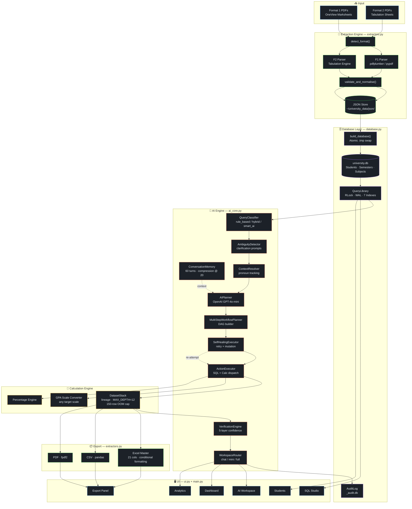
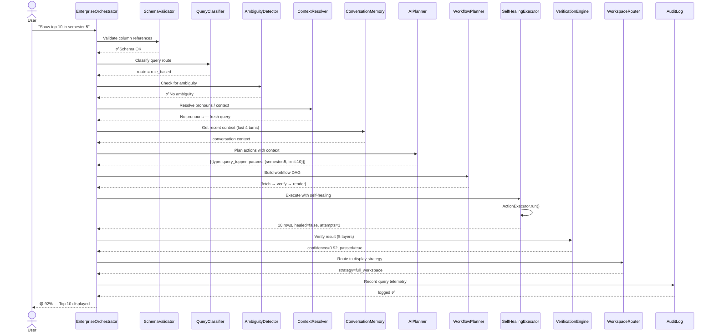
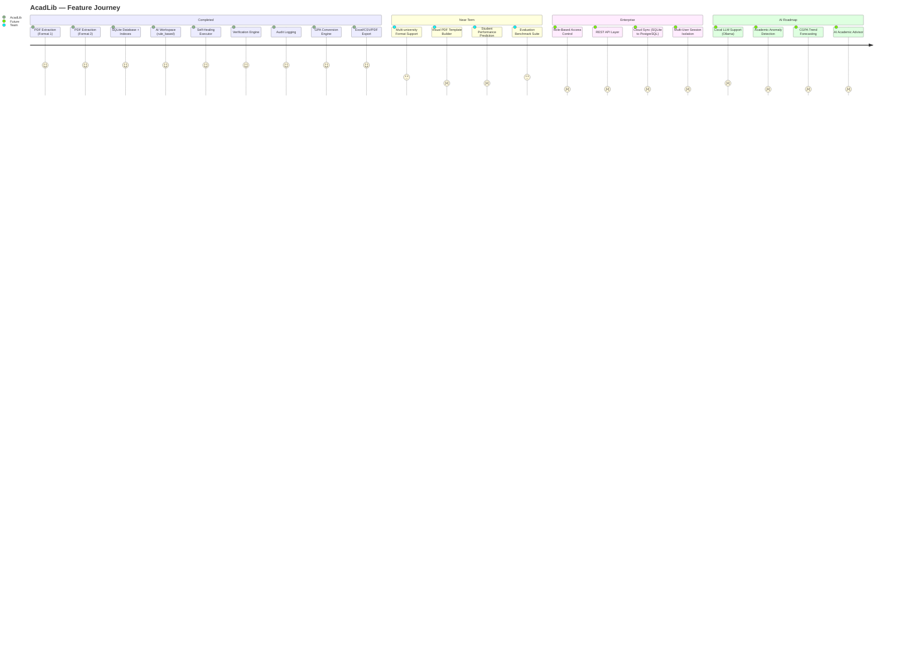

<div align="center">


<br/>


<br/><br/>

<table>
<tr>
<td>

[](https://python.org)
[](https://sqlite.org)
[](https://openai.com)

</td>
<td>

[](https://langchain.com)
[](https://docs.python.org/3/library/tkinter.html)

</td>
<td>

[]()
[]()
[](https://github.com/NIKHILUTTAM/AcadLib)

</td>
</tr>
</table>

<br/>

<table>
<tr>
<td align="center"></td>
<td align="center"></td>
<td align="center"></td>
<td align="center"></td>
<td align="center"></td>
</tr>
</table>

<br/>

<blockquote>
<p><strong>Turn fragmented examination records into a live intelligence layer.</strong><br/>
AcadLib is a production-grade desktop application that ingests university result PDFs,<br/>
builds a fully-indexed relational database, and exposes that data through<br/>
natural language, raw SQL, verified analytics, and exportable reports —<br/>
all without writing a single line of code.</p>
</blockquote>

</div>

---

## 📖 Table of Contents

<details>
<summary><b>🗂 Click to expand the full Table of Contents</b></summary>

| # | Section |
|---|---|
| 1 | [🌟 Why AcadLib?](#-why-acadlib) |
| 2 | [✨ Feature Overview](#-feature-overview) |
| 3 | [⚡ How It Works — The Data Pipeline](#-how-it-works--the-data-pipeline) |
| 4 | [🏗 System Architecture](#-system-architecture) |
| 5 | [🤖 The AI Engine — 9 Components](#-the-ai-engine--9-components) |
| 6 | [🖥 Terminal Demo — AI in Action](#-terminal-demo--ai-in-action) |
| 7 | [🗄 Database Design](#-database-design) |
| 8 | [🎯 Confidence Scoring System](#-confidence-scoring-system) |
| 9 | [📥 PDF Extraction Engine](#-pdf-extraction-engine) |
| 10 | [📊 Analytics & Export](#-analytics--export) |
| 11 | [💬 Query Reference Card](#-query-reference-card) |
| 12 | [🔄 Workflow Walkthroughs](#-workflow-walkthroughs) |
| 13 | [🚀 Quick Start](#-quick-start) |
| 14 | [⚙️ Configuration](#️-configuration) |
| 15 | [📁 Project Structure](#-project-structure) |
| 16 | [📦 Technology Stack](#-technology-stack) |
| 17 | [📈 Roadmap](#-roadmap) |
| 18 | [🤝 Contributing](#-contributing) |
| 19 | [👨‍💻 Author](#-author) |

</details>

---

## 🌟 Why AcadLib?

Every semester, universities produce thousands of result records — buried in PDFs, locked inside examination portals, or scattered across spreadsheets. Querying this data means manual effort, fragile Excel formulas, or expensive proprietary systems.

**AcadLib replaces all of that with a single desktop application.**

<table>
<thead>
<tr>
<th>❌ Traditional Workflow</th>
<th>✅ AcadLib Workflow</th>
</tr>
</thead>
<tbody>
<tr>
<td>Download PDFs manually each semester</td>
<td>Upload once — extraction is automatic</td>
</tr>
<tr>
<td>Build Excel pivot tables by hand</td>
<td><code>Show branch-wise CGPA comparison</code> → instant results</td>
</tr>
<tr>
<td>Write SQL queries from scratch</td>
<td>Natural language → verified SQL → workspace</td>
</tr>
<tr>
<td>Static, re-generated reports</td>
<td>Live dataset with full lineage tracking</td>
</tr>
<tr>
<td>No audit trail whatsoever</td>
<td>Every query logged with route + confidence score</td>
</tr>
<tr>
<td>New semester = re-do everything</td>
<td>Incremental update — merge new PDF into existing DB</td>
</tr>
<tr>
<td>Siloed data, no error checking</td>
<td>Self-healing queries + 5-layer verification engine</td>
</tr>
<tr>
<td>AI? Not a chance.</td>
<td>Conversational copilot with pronoun resolution + memory</td>
</tr>
</tbody>
</table>

---

## ✨ Feature Overview

<table>
<tr>
<td width="50%">

### 📥 Dual-Format PDF Extraction
<details open>
<summary>Automatically detects and parses two university result formats</summary>

- **Format 1** — OneView (individual marksheets, pdfplumber / pypdf)
- **Format 2** — Tabulation sheets (batch, CP notation, back-paper flags)
- Compiled regex pipeline for subject rows, semester blocks, header fields
- Dry-run mode, merge conflict detection (`updated / skipped / conflict / created`)
- Validates every extracted record before persisting

</details>

</td>
<td width="50%">

### 🗄 Enterprise SQLite Database
<details open>
<summary>WAL-mode, indexed, thread-safe academic knowledge base</summary>

- WAL journal mode + `PRAGMA synchronous=NORMAL`
- Thread-safe via `threading.RLock` throughout
- 7 targeted indexes on hot paths: name, CGPA, grade, roll number, semester
- Foreign key integrity enforced across 3 tables
- Atomic rebuild: `.tmp` swap — existing DB never corrupted
- Pre-computed `cgpa`, `failed_subjects`, `semesters_completed` on ingest

</details>

</td>
</tr>
<tr>
<td width="50%">

### 🤖 AI Workspace — Conversational Copilot
<details>
<summary>9-component orchestrator for natural-language academic queries</summary>

- `QueryClassifier` → `AIPlanner` → `SelfHealingExecutor` pipeline
- Pronoun + context resolution across 60-turn memory window
- Self-heals on failure (re-attempts with relaxed parameters)
- 5-layer verification before every result is displayed
- Confidence badge: `🟢 95%` / `🟡 74%` / `🔴 44%`
- Full audit log in a separate `_audit.db`

</details>

</td>
<td width="50%">

### 🧠 SQL Studio
<details>
<summary>AI-assisted SQL exploration with hallucination prevention</summary>

- LangChain `create_sql_agent` (OpenAI Tools / Tool Calling)
- Schema injection into system prompt → no hallucinated columns
- Up to `max_iterations=15` per query
- Live schema introspection with `PRAGMA table_info`
- `top_k` tuned to dataset size (bounded at 500)

</details>

</td>
</tr>
<tr>
<td width="50%">

### 📊 Analytics Engine
<details>
<summary>Window functions, branch stats, grade distributions, GPA conversion</summary>

- `RANK() OVER (ORDER BY ...)` window functions throughout
- Branch comparison, semester trends, subject difficulty analysis
- Grade distribution per semester or globally
- GPA scale conversion engine (any target scale, e.g. 4.0, 10.0)
- Dataset provenance chain tracks every transformation

</details>

</td>
<td width="50%">

### 📦 Export Engine
<details>
<summary>Excel, CSV, and PDF with professional formatting</summary>

- **Excel Master**: 21-column report, conditional cell fills, grade-color fonts, auto-filter, freeze panes
- **CSV**: pandas-powered flat export
- **PDF**: fpdf2 with auto column widths and header row
- Export inherits from current workspace context — no re-query needed

</details>

</td>
</tr>
<tr>
<td width="50%">

### 🔍 Audit & Observability
<details>
<summary>Per-query telemetry stored in a dedicated SQLite audit database</summary>

- Records: timestamp, query text, route, execution ms, rows returned, workspace, confidence, status, error
- `audit_log.recent(20)` and `audit_log.stats()` for session metrics
- Confidence tracking across all queries in a session
- Separate `_audit.db` file — never contaminates main data

</details>

</td>
<td width="50%">

### 🔄 Workflow Intelligence
<details>
<summary>Dataset lineage, multi-step DAGs, context preservation</summary>

- `DatasetStack` tracks up to 12 transformation frames
- 150-row in-memory cap per frame prevents OOM on large AI chains
- Provenance chain: `query_topper(10) → convert_scale(10) → export_excel`
- `MultiStepWorkflowPlanner` builds a DAG from action lists
- `WorkflowStateManager` persists last student name, last semester, last route

</details>

</td>
</tr>
</table>

---

## ⚡ How It Works — The Data Pipeline

```
┌─────────────────────────────────────────────────────────────────────────┐
│                         ACADLIB DATA PIPELINE                           │
├─────────────────────────────────────────────────────────────────────────┤
│                                                                         │
│  📄 University PDFs                                                     │
│        │                                                                │
│        ▼                                                                │
│  ┌─────────────────────┐   detect_format()                             │
│  │   Format Detector   │──────────────────→  "format_1" or "format_2"  │
│  └─────────────────────┘                                               │
│        │                                                                │
│        ├──────────────────────────────────────────┐                    │
│        ▼                                          ▼                    │
│  ┌──────────────┐                      ┌──────────────────┐           │
│  │  F1 Parser   │                      │   F2 Parser      │           │
│  │  (pdfplumber │                      │ (Tabulation +    │           │
│  │   / pypdf)   │                      │  CP notation)    │           │
│  └──────────────┘                      └──────────────────┘           │
│        │                                          │                    │
│        └──────────────────┬───────────────────────┘                   │
│                           ▼                                            │
│                  ┌─────────────────┐                                   │
│                  │   Validator &   │  validate_and_normalise()         │
│                  │   Normaliser    │  (raises ValueError on bad data)  │
│                  └─────────────────┘                                   │
│                           │                                            │
│                           ▼                                            │
│                  ┌─────────────────┐                                   │
│                  │   JSON Store    │  ~/university_data/json/          │
│                  │  (one file per  │  {roll_number}.json               │
│                  │   student)      │                                   │
│                  └─────────────────┘                                   │
│                           │                                            │
│                           ▼                                            │
│                  ┌─────────────────────────────────────┐              │
│                  │         build_database()             │              │
│                  │  JSON → students + semesters +       │              │
│                  │  subjects tables (atomic .tmp swap)  │              │
│                  └─────────────────────────────────────┘              │
│                           │                                            │
│                           ▼                                            │
│          ┌────────────────────────────────────┐                       │
│          │          university.db              │                       │
│          │  WAL · Indexed · Thread-safe        │                       │
│          └────────────────────────────────────┘                       │
│                           │                                            │
│          ┌────────────────┼────────────────────┐                      │
│          ▼                ▼                    ▼                       │
│   ┌────────────┐  ┌────────────────┐  ┌────────────────┐             │
│   │ AI Workspace│  │  SQL Studio    │  │ Analytics &    │             │
│   │ (NL Queries)│  │ (LangChain)   │  │ Export Engine  │             │
│   └────────────┘  └────────────────┘  └────────────────┘             │
│                                                                        │
└────────────────────────────────────────────────────────────────────────┘
```

---

## 🏗 System Architecture



---

## 🤖 The AI Engine — 9 Components

The AI system in `ai_core.py` is not a monolithic chatbot. It is a **multi-stage orchestration system** with nine composable, independently testable components.



<br/>

<details>
<summary><b>📋 Component Reference — click to expand</b></summary>

<br/>

**`QueryClassifier`** — Route Detection
> Maps each query to one of three pipelines: `rule_based` (keyword match, no API call), `hybrid` (rule + LLM verification), or `smart_ai` (full OpenAI planning). Determines cost and latency before execution.

---

**`AIPlanner`** — OpenAI Intent Parsing
> Calls GPT-4o-mini with: schema context, last 4 conversation turns, current workflow state (`last_name`, `last_sem`). Returns a structured action plan:
```json
{ "message": "Fetching Semester 5 toppers...",
  "actions": [{ "type": "query_topper", "params": { "semester": 5, "limit": 10 } }] }
```

---

**`ContextResolver`** — Pronoun & Dataset Resolution
> Detects pronouns (`their`, `them`, `those students`, `previous result`, `this report`) via compiled regex. Injects prior dataset into current query without re-hitting the database. Enables chained workflows.

---

**`AmbiguityDetector`** — Clarification Prompts
> Intercepts queries with multiple valid interpretations. Asks a targeted clarifying question before any SQL is executed — preventing silent misdirection.

---

**`SelfHealingExecutor`** — Auto-Retry on Failure
> Wraps `ActionExecutor` in a retry loop. On failure, mutates action parameters (relaxes filters, broadens scope) and re-attempts. Tracks `healed: bool` and `attempts: int` — both applied as confidence penalties.

---

**`VerificationEngine`** — 5-Layer Confidence Scoring
> Validates: dataset non-empty, sort order correctness, row count vs. expected total, context resolution success, route availability. Returns `confidence` ∈ [0.0, 1.0]. See [Confidence Scoring System](#-confidence-scoring-system).

---

**`ConversationMemory`** — 60-Turn Rolling Window
> Stores up to 60 turns. Compresses at every 20-turn boundary into a summary string to prevent context overflow. Also tracks `workflow_success_rate()` across the session.

---

**`WorkspaceRouter`** — Display Strategy Selection
> Routes results based on dataset size and action type:
> - `chat_inline` — small results, formatted in chat
> - `mini_workspace` — medium results, mini table (≤ 50 rows)
> - `full_workspace` — large datasets, main panel

---

**`AuditLog`** — Persistent Observability
> Every `orchestrator.run()` writes to `_audit.db`: `timestamp`, `query`, `route`, `execution_ms`, `rows_returned`, `workspace_used`, `confidence`, `status`, `error`. Queryable via `audit_log.recent()` and `audit_log.stats()`.

</details>

---

## 🖥 Terminal Demo — AI in Action

> A simulated session showing the AI Workspace handling a real multi-step workflow.

```
╔══════════════════════════════════════════════════════════════════════════╗
║  AcadLib  ·  AI Workspace  ·  Session #1                               ║
╠══════════════════════════════════════════════════════════════════════════╣
║                                                                          ║
║  You:  Show top 10 students in semester 5                                ║
║                                                                          ║
║  ┌─ AcadLib ─────────────────────────────────────────────────────────┐  ║
║  │  Route: rule_based · Action: query_topper · Sem: 5 · Limit: 10   │  ║
║  │                                                                    │  ║
║  │  RANK  NAME              ROLL        BRANCH    SGPA   STATUS      │  ║
║  │  ────  ────────────────  ──────────  ────────  ─────  ──────────  │  ║
║  │    1   Ananya Sharma     2100140001  CS         9.82   PASS       │  ║
║  │    2   Rohan Mehta       2100140012  CS         9.74   PASS       │  ║
║  │    3   Priya Gupta       2100130008  ECE        9.71   PASS       │  ║
║  │   ...  (7 more rows)                                              │  ║
║  │                                                                    │  ║
║  │  🟢 92% · 10 rows · 48ms                                          │  ║
║  └────────────────────────────────────────────────────────────────────┘  ║
║                                                                          ║
║  You:  Convert their CGPA to 4.0 GPA scale                              ║
║                                                                          ║
║  ┌─ AcadLib ─────────────────────────────────────────────────────────┐  ║
║  │  ContextResolver: "their" → previous 10 rows ✅                   │  ║
║  │  CalculationEngine: (cgpa / 10.0) × 4.0 applied                  │  ║
║  │  Provenance: query_topper(10) → convert_scale(10)                 │  ║
║  │                                                                    │  ║
║  │  NAME              SGPA    CGPA    GPA (4.0)                      │  ║
║  │  ────────────────  ──────  ──────  ──────────                     │  ║
║  │  Ananya Sharma      9.82    9.47      3.79                        │  ║
║  │  Rohan Mehta        9.74    9.31      3.72                        │  ║
║  │  Priya Gupta        9.71    9.28      3.71                        │  ║
║  │   ...  (7 more rows)                                              │  ║
║  │                                                                    │  ║
║  │  🟢 88% · conversion applied · 61ms                               │  ║
║  └────────────────────────────────────────────────────────────────────┘  ║
║                                                                          ║
║  You:  Export this report                                                ║
║                                                                          ║
║  ┌─ AcadLib ─────────────────────────────────────────────────────────┐  ║
║  │  ContextResolver: "this report" → last_exportable_dataset ✅      │  ║
║  │  DataExporter.to_excel_master() → top_10_sem5_gpa4.xlsx           │  ║
║  │  ✅ Export complete → ~/university_data/exports/                  │  ║
║  └────────────────────────────────────────────────────────────────────┘  ║
║                                                                          ║
╚══════════════════════════════════════════════════════════════════════════╝
```

---

## 🗄 Database Design

```
┌──────────────────────────────────────────────────────────────────┐
│                        students                                   │
├──────────────────────────────────────────────────────────────────┤
│ id PK │ name* │ roll_number UNIQUE │ enrollment_number           │
│ institute_code │ institute_name* │ course │ branch*              │
│ gender │ father_name* │ source_file                              │
│ cgpa (pre-computed) │ semesters_completed │ failed_subjects       │
└──────────────────────┬───────────────────────────────────────────┘
                       │ 1 : N
┌──────────────────────▼───────────────────────────────────────────┐
│                        semesters                                  │
├──────────────────────────────────────────────────────────────────┤
│ id PK │ student_id FK │ semester_number │ even_odd │ session     │
│ sgpa │ total_marks_obtained │ result_status │ date_of_declaration │
│ total_subjects │ theory_subjects │ practical_subjects             │
└──────────────────────┬───────────────────────────────────────────┘
                       │ 1 : N
┌──────────────────────▼───────────────────────────────────────────┐
│                        subjects                                   │
├──────────────────────────────────────────────────────────────────┤
│ id PK │ semester_id FK │ subject_code* │ subject_name*           │
│ subject_type (Theory / Practical / CA)                           │
│ internal_marks │ external_marks │ total_marks │ back_paper_marks  │
│ grade                                                            │
└──────────────────────────────────────────────────────────────────┘

* = COLLATE NOCASE index supported
```

**Indexes:**

| Index | Table | Column | Purpose |
|---|---|---|---|
| `idx_students_name` | students | `name` | LIKE search by name |
| `idx_students_cgpa` | students | `cgpa` | Ranking queries |
| `idx_students_fails` | students | `failed_subjects` | Fail report filter |
| `idx_semesters_student_id` | semesters | `student_id` | JOIN optimization |
| `idx_semesters_sem_num` | semesters | `semester_number` | Semester filter |
| `idx_subjects_semester_id` | subjects | `semester_id` | JOIN optimization |
| `idx_subjects_grade` | subjects | `grade` | Grade distribution |

**Grade Color System** (from `config.py`):

<table>
<tr>
<td> Outstanding</td>
<td> Excellent</td>
<td> Very Good</td>
<td> Good</td>
</tr>
<tr>
<td> Average</td>
<td> Below Avg</td>
<td> Fail</td>
<td> Fail (Back Paper)</td>
</tr>
</table>

---

## 🎯 Confidence Scoring System

Every result goes through `ExecutionReport.confidence()` — a mathematical scoring formula, not a heuristic:

```python
# Base confidence: 0.20 per satisfied check (max 1.0)
checks = [sql_ok, verification_ok, calculation_ok, workspace_ok, context_resolved]
confidence = sum(0.20 for ch in checks if ch)

# Penalties applied after base score
if healed:         confidence -= 0.05   # self-healing was required
if attempts > 2:   confidence -= 0.05   # more than 2 execution attempts
if error:          confidence  = c * 0.30  # error occurred — severe penalty
if rows == 0 and not error:
    confidence = max(confidence, 0.50)  # empty result is not necessarily wrong
```

**Badge thresholds:**

```
┌──────────────────────────────────────────────────────────┐
│  confidence ≥ 0.90   →   🟢  High confidence result     │
│  confidence ≥ 0.70   →   🟡  Moderate — review advised  │
│  confidence  < 0.70  →   🔴  Low — treat with caution   │
└──────────────────────────────────────────────────────────┘
```

**Special case — Schema Rejection:**
If `SchemaValidator` detects an invalid column reference before execution, `schema_rejected = True` and confidence is fixed at `0.93` (the query was blocked cleanly, which is high-confidence behavior).

---

## 📥 PDF Extraction Engine

<details>
<summary><b>Format 1 — OneView Marksheets</b></summary>

**Detection:**
```python
if "ONEVIEW" in text.upper() or "DATE OF DECLARATION" in text.upper():
    return "format_1"
```

**Header extraction** uses named-group regex patterns for: institute code, course, roll number, enrollment number, student name, father's name, gender, branch.

**Subject row regex** (compiled at module load):
```python
SUBJECT_RE_F1 = re.compile(
  r'^([A-Z]{2,5}\d{3,4}[A-Z]?)'  # subject code
  r'\s+(.*?)'                      # subject name
  r'\s+(Theory|Practical|CA)'     # subject type
  r'\s+(\d{1,3}|--)'              # internal marks
  r'\s+(\d{1,3}\*?|--)'           # external marks (asterisk = back paper)
  r'\s*(?:(\d{1,3}\*?|--)\s*)?'  # back paper marks (optional)
  r'([A-Z][+#]?|--)?\s*$',        # grade
  re.IGNORECASE
)
```

**Semester splitting** by `Semester: N  Even/Odd: Odd|Even` markers, preserving block boundaries.

</details>

<details>
<summary><b>Format 2 — Tabulation Sheets</b></summary>

**Detection:**
```python
if "TABULATION" in text.upper() or "CP(" in text.upper():
    return "format_2"
```

Batch-format parser. Reads document-level headers (institute, branch, subject definitions) once, then parses one row per student. Handles:
- CP (credit point) notation: `CP( 42)` → result status
- Back-paper codes: extracted into a set, applied per-subject
- `--` as null marks (not zero)
- Grand total column
- SGPA column

</details>

<details>
<summary><b>Format 2 Merge Logic</b></summary>

When uploading Format 2 data for students already in the JSON store, `run_format2_update()` applies an intelligent merge:

| Result | Condition |
|---|---|
| `updated` | Student found, new semester appended |
| `skipped` | Student found, semester already present with matching SGPA |
| `conflict` | Student found, semester present but SGPA differs |
| `created` | Student not found — new JSON file created |

Dry-run mode available: `dry_run=True` reports what would happen without writing files.

</details>

---

## 📊 Analytics & Export

### Built-in Query Library — Named Methods

```python
# Rankings
qlib.rank_students_by_sgpa(semester=5, limit=10)   # RANK() OVER SGPA
qlib.rank_students_by_cgpa(limit=20)               # RANK() OVER CGPA
qlib.list_all_students_full()                       # Full rank table

# Fail Analysis
qlib.get_fail_report()                             # All students with fails
qlib.get_fail_report_semester(semester=3)          # Semester-specific, GROUP_CONCAT

# Analytics
qlib.all_semester_stats()                          # AVG/MAX/MIN SGPA per semester
qlib.grade_distribution(semester=5)               # Grade counts per semester
qlib.branch_stats()                                # Branch avg/max CGPA
qlib.get_student_subjects(name, semester)         # Subject-level detail

# Pagination
qlib.list_students_paginated(limit, offset, search, sort_col, sort_asc)
qlib.count_students(search)                        # Safe injection-proof column map
```

> **SQL Injection Prevention:** `list_students_paginated` uses a strict `safe_cols` whitelist for `ORDER BY` — dynamic column names are never interpolated directly.

### GPA Conversion Engine

Detected automatically from query text:

```
"convert to percentage"     →  {"type": "percentage"}
"convert to 4.0 scale"      →  {"type": "scale", "target_scale": 4.0}
"convert to GPA 10"         →  {"type": "scale", "target_scale": 10.0}
"convert to 4 point"        →  {"type": "scale", "target_scale": 4.0}
```

Conversion applies to the **active DatasetStack frame** and is pushed as a new provenance entry — full lineage preserved.

### Excel Master Report

21-column export with professional conditional formatting:

| Condition | Cell Treatment |
|---|---|
| Grade F / E / E# | Red background `#FADBD8` |
| Back paper marks present | Yellow background `#FEF9E7` |
| Even row (no special condition) | Light grey `#F2F2F2` |
| CGPA ≥ 8.0 | Green bold font |
| CGPA ≥ 6.5 | Blue bold font |
| CGPA < 6.5 | Orange bold font |
| Grade cell | Grade-specific color from `GRADE_CLR` map |

Auto-filter on all 21 columns, freeze pane at row 2, Calibri font, thin borders on every cell.

---

## 💬 Query Reference Card

<table>
<thead>
<tr>
<th>Query</th>
<th>Action Type</th>
<th>Route</th>
</tr>
</thead>
<tbody>
<tr><td><code>Show topper semester 5</code></td><td><code>query_topper</code></td><td>rule_based</td></tr>
<tr><td><code>Top 20 students by CGPA</code></td><td><code>cgpa_rankings</code></td><td>rule_based</td></tr>
<tr><td><code>Fail report semester 3</code></td><td><code>fail_report</code></td><td>rule_based</td></tr>
<tr><td><code>Show Priya's marks in semester 2</code></td><td><code>subject_detail</code></td><td>rule_based</td></tr>
<tr><td><code>Convert their GPA to 4.0 scale</code></td><td><code>convert_scale</code></td><td>rule_based + context</td></tr>
<tr><td><code>Grade distribution semester 4</code></td><td><code>grade_distribution</code></td><td>rule_based</td></tr>
<tr><td><code>Compare semester-wise performance</code></td><td><code>semester_stats</code></td><td>rule_based</td></tr>
<tr><td><code>Which branch has the highest CGPA?</code></td><td><code>branch_stats</code></td><td>hybrid</td></tr>
<tr><td><code>Export current report to Excel</code></td><td><code>export_excel</code></td><td>rule_based</td></tr>
<tr><td><code>Students with CGPA above 8.5 in CS</code></td><td><code>smart_sql</code></td><td>smart_ai</td></tr>
<tr><td><code>Which subject has the highest fail rate?</code></td><td><code>smart_sql</code></td><td>smart_ai</td></tr>
<tr><td><code>How many failed more than 3 subjects?</code></td><td><code>smart_sql</code></td><td>smart_ai</td></tr>
</tbody>
</table>

> **Pronoun resolution** is active across all queries. Saying "their", "those students", "this report", "previous result" always refers to the last active dataset — no re-query needed.

---

## 🔄 Workflow Walkthroughs

<details open>
<summary><b>Workflow A — Ranked Report with Scale Conversion + Export</b></summary>

```
Step 1 ──  User: "Show top 10 students in semester 5"
           │
           ├─ QueryClassifier  →  route = rule_based
           ├─ AIPlanner        →  query_topper(semester=5, limit=10)
           ├─ ActionExecutor   →  rank_students_by_sgpa(5, 10)
           ├─ DatasetStack     →  push(10 rows, "query_topper")
           └─ VerificationEngine → sort order ✓, count ✓ → 🟢 92%

Step 2 ──  User: "Convert their CGPA to 4.0 GPA scale"
           │
           ├─ ContextResolver  →  "their" → previous 10 rows ✅
           ├─ _inject_conversion → adds convert_gpa4=True to actions
           ├─ CalculationEngine →  (cgpa / 10.0) × 4.0 per row
           ├─ DatasetStack     →  push(10 rows, "convert_scale")
           │                      chain: query_topper(10) → convert_scale(10)
           └─ VerificationEngine → calculation ✓ → 🟢 88%

Step 3 ──  User: "Export this report"
           │
           ├─ ContextResolver  →  "this" → last_exportable_dataset ✅
           ├─ DataExporter     →  to_excel_master() → top_10_sem5_gpa4.xlsx
           └─  ✅ Export complete · Provenance attached to file
```

</details>

<details>
<summary><b>Workflow B — Fail Analysis → Count Query</b></summary>

```
Step 1 ──  User: "Generate fail report for semester 3"
           │
           ├─ get_fail_report_semester(3)
           │  Returns: name, roll, branch, failed_count, GROUP_CONCAT(subjects)
           ├─ DatasetStack  →  push(N rows, "fail_report")
           └─ VerificationEngine → rows > 0 ✓ → 🟢 91%

Step 2 ──  User: "How many students failed more than 2 subjects?"
           │
           ├─ QueryClassifier  →  route = smart_ai
           ├─ LangChain SQL Agent (schema injected → no hallucinations)
           │  Generated SQL: SELECT COUNT(*) FROM students
           │                 WHERE failed_subjects > 2
           └─ 🟢 88% · "47 students failed more than 2 subjects"
```

</details>

<details>
<summary><b>Workflow C — Self-Healing in Action</b></summary>

```
Step 1 ──  User: "Show Priya's semester 3 marks"
           │
           ├─ ActionExecutor  →  find_student("Priya") → 0 rows
           │                     (exact match failed)
           │
           ├─ SelfHealingExecutor → healed=True, attempts=2
           │   Mutation: exact "Priya" → LIKE "%Priya%"
           │   Re-attempt → 3 rows returned
           │
           ├─ VerificationEngine → confidence penalty: -0.05 (healed)
           └─ 🟡 74% · Results shown · heal noted in confidence badge
```

</details>

---

## 🚀 Quick Start

### Prerequisites

| Requirement | Version | Notes |
|---|---|---|
| Python | 3.10+ | `python --version` to check |
| OS | Windows / macOS / Linux | Tkinter included with Python |
| OpenAI API Key | Optional | Only for AI Workspace + SQL Agent |
| Disk Space | ~50 MB | Plus your data files |

### Step-by-Step

**1. Clone**
```bash
git clone https://github.com/NIKHILUTTAM/AcadLib.git
cd AcadLib
```

**2. Install dependencies**
```bash
pip install pdfplumber pypdf openpyxl pandas fpdf2 \
            langchain langchain-community langchain-openai openai
```

**3. Set API key** *(optional — skip if you don't need AI/SQL Agent)*

```bash
# Windows (Command Prompt)
set OPENAI_API_KEY=sk-your-key-here

# Windows (PowerShell)
$env:OPENAI_API_KEY = "sk-your-key-here"

# Linux / macOS
export OPENAI_API_KEY=sk-your-key-here
```

Or paste your key directly in the **Settings** panel after launch.

**4. Launch**
```bash
python main.py
```

**5. First-time setup flow**

```
Upload F1  →  select your Format 1 PDFs  →  Extract
    ↓
Upload F2  →  select your Format 2 PDFs  →  Merge
    ↓
Database   →  click "Rebuild Database"
    ↓
AI Workspace  →  type your first query ✅
```

> **No PDFs yet?** Navigate to **Students** to explore the bundled demo dataset, or open **SQL Studio** to query directly.

---

## ⚙️ Configuration

All settings persist at `~/university_data/settings.json`:

```json
{
  "json_dir":    "~/university_data/json",
  "db_path":     "~/university_data/university.db",
  "export_dir":  "~/university_data/exports",
  "openai_key":  "sk-...",
  "model":       "gpt-4o-mini"
}
```

| Setting | Default | Description |
|---|---|---|
| `json_dir` | `~/university_data/json` | Extracted student JSON files |
| `db_path` | `~/university_data/university.db` | SQLite database path |
| `export_dir` | `~/university_data/exports` | Excel / CSV / PDF output |
| `openai_key` | `""` | OpenAI API key |
| `model` | `gpt-4o-mini` | Model for AIPlanner + SQL Agent |

**Graceful degradation** — no API key required for:

| Feature | No API Key | With API Key |
|---|---|---|
| PDF Extraction | ✅ Full | ✅ Full |
| Database Build | ✅ Full | ✅ Full |
| Analytics Panel | ✅ Full | ✅ Full |
| Students Panel | ✅ Full | ✅ Full |
| Export (Excel/CSV/PDF) | ✅ Full | ✅ Full |
| AI Workspace (rule_based) | ✅ Full | ✅ Full |
| AI Workspace (smart_ai) | ❌ Requires key | ✅ Full |
| SQL Studio Agent | ❌ Requires key | ✅ Full |

---

## 📁 Project Structure

```text
AcadLib/
│
├── 🚀 main.py
│      Tkinter App root · panel routing · event bindings
│      Panels: Dashboard, Upload F1/F2, Database, Students,
│              Analytics, AI Workspace, SQL Studio, Export, Settings
│
├── ⚙️ config.py
│      AppState — settings, DB init, agent init
│      THEME dict — 18 color tokens matching GitHub dark palette
│      Font definitions (Segoe UI / Cascadia Code)
│      Grade colors map · RotatingFileHandler (5MB, 3 backups)
│
├── 🤖 ai_core.py  ─── The AI Orchestration System ───
│   ├── ConversationMemory      60-turn rolling window, compression @ 20
│   ├── WorkflowStateManager    DatasetStack, context tracking, new_workflow()
│   ├── ContextResolver         Pronoun regex, dataset injection, name/sem tracking
│   ├── CalculationEngine       GPA / percentage transforms
│   ├── QueryClassifier         Route detection: rule_based / hybrid / smart_ai
│   ├── AIPlanner               OpenAI GPT-4o-mini intent parsing
│   ├── SchemaValidator         Pre-flight column reference validation
│   ├── AmbiguityDetector       Clarification prompt injection
│   ├── ActionExecutor          SQL + Calc dispatch
│   ├── SelfHealingExecutor     Retry wrapper with parameter mutation
│   ├── VerificationEngine      5-layer confidence scoring
│   ├── WorkspaceRouter         Display strategy selection
│   ├── MultiStepWorkflowPlanner DAG builder from action lists
│   ├── EnterpriseOrchestrator  Top-level run loop (all components composed here)
│   └── EvaluationRunner        Offline test harness for QueryClassifier + AIPlanner
│
├── 🗄 database.py
│   ├── build_database()        Atomic JSON → SQLite pipeline (.tmp swap)
│   ├── QueryLibrary            Thread-safe (RLock) · WAL · named methods
│   └── AuditLog                Per-query observability in _audit.db
│
├── 🔬 extractors.py
│   ├── detect_format()         OneView vs Tabulation detection
│   ├── F1 pipeline             parse_student_header_f1, parse_subjects_f1, split_semesters_f1
│   ├── F2 pipeline             parse_format2_pdf, parse_student_block_f2, run_format2_update
│   └── DataExporter            CSV / Excel simple / Excel master (21-col) / PDF
│
├── 📐 models.py
│   ├── SubjectRecord, SemesterRecord, StudentRecord   (dataclasses)
│   ├── DatasetStack            Provenance chain · MAX_DEPTH=12 · 150-row OOM cap
│   ├── DatasetEntry, DatasetProvenance
│   ├── ResultMeta              Truncation + overflow detection
│   ├── ExecutionReport         Confidence formula, badge, route tracking
│   └── WorkflowStep            DAG node with status + dependency list
│
├── 🖥 ui.py
│   ├── apply_theme()           Dark theme injection into Tkinter
│   ├── Sidebar                 Navigation with active-state highlighting
│   ├── DashboardPanel          Stats overview + quick actions
│   ├── UploadF1Panel           PDF upload + extraction progress
│   ├── UploadF2Panel           Batch PDF merge with conflict reporting
│   ├── DatabasePanel           Rebuild trigger + schema viewer
│   ├── StudentsPanel           Paginated table with search + sort
│   ├── AnalyticsPanel          Charts, rankings, grade distributions
│   ├── ChatbotPanel            AI Workspace — chat UI + workspace viewer
│   ├── SQLAgentPanel           SQL Studio — query editor + results
│   ├── ExportPanel             Format selector + export triggers
│   └── SettingsPanel           API key, model, paths configuration
│
└── 📦 __init__.py             Package exports
```

---

## 📦 Technology Stack

<table>
<tr>
<th>Layer</th>
<th>Technology</th>
<th>Why This Choice</th>
</tr>
<tr>
<td><b>Language</b></td>
<td>


</td>
<td>Broad library support, rapid iteration, strong AI/data ecosystem</td>
</tr>
<tr>
<td><b>Desktop UI</b></td>
<td>


</td>
<td>Zero-install native GUI; runs offline on any Python 3 environment</td>
</tr>
<tr>
<td><b>Database</b></td>
<td>


</td>
<td>Embedded, serverless, ACID; WAL mode enables concurrent UI/AI reads</td>
</tr>
<tr>
<td><b>PDF Extraction</b></td>
<td>


</td>
<td>pdfplumber for structured extraction; pypdf as fallback for broader compat</td>
</tr>
<tr>
<td><b>AI Planning</b></td>
<td>


</td>
<td>Fast, cost-efficient intent parsing; supports function calling natively</td>
</tr>
<tr>
<td><b>SQL Agent</b></td>
<td>


</td>
<td>create_sql_agent with schema injection; max_iterations guard prevents runaway</td>
</tr>
<tr>
<td><b>Concurrency</b></td>
<td>


</td>
<td>Reentrant lock on QueryLibrary — safe for concurrent UI polling + AI queries</td>
</tr>
<tr>
<td><b>Data Export</b></td>
<td>


</td>
<td>openpyxl for styled Excel; pandas for CSV; fpdf2 for PDF table rendering</td>
</tr>
<tr>
<td><b>Logging</b></td>
<td>


</td>
<td>5 MB rolling log with 3 backups; dual stream to file + stdout</td>
</tr>
<tr>
<td><b>Observability</b></td>
<td>


</td>
<td>Dedicated _audit.db with confidence, route, ms — fully queryable</td>
</tr>
</table>

---

## 📈 Roadmap



<details>
<summary><b>📋 Full Roadmap Details</b></summary>

**Near-Term**
- [ ] Dynamic template builder for non-standard university PDF formats
- [ ] Visual Format Designer with regex builder UI
- [ ] Student success prediction (CGPA trend extrapolation)
- [ ] Offline `EvaluationRunner` benchmark suite with CI integration
- [ ] Planner accuracy regression tests for `AIPlanner` + `QueryClassifier`

**Enterprise Features**
- [ ] Role-based access control (Admin / Analyst / Viewer)
- [ ] Multi-user session isolation
- [ ] REST API layer over `QueryLibrary`
- [ ] Cloud synchronization (SQLite → PostgreSQL migration path)
- [ ] Institution-level multi-campus dashboards

**AI Improvements**
- [ ] Local LLM support (Ollama) for air-gapped / offline deployments
- [ ] Academic performance forecasting (semester trend extrapolation)
- [ ] Anomaly detection (outlier grade patterns, attendance correlation)
- [ ] AI Academic Advisor (student-facing narrative report generation)
- [ ] Query confidence calibration via historical audit data

</details>

---

## 🤝 Contributing

Contributions are welcome. For major changes, please open an issue first.

```bash
# 1. Fork and clone
git clone https://github.com/YOUR_USERNAME/AcadLib.git
cd AcadLib

# 2. Create a feature branch
git checkout -b feature/your-feature-name

# 3. Make your changes

# 4. Commit (conventional commits preferred)
git commit -m "feat: add support for Format 3 PDF layout"

# 5. Push and open a PR
git push origin feature/your-feature-name
```

**Contribution guidelines:**
- All new `QueryLibrary` methods must use the `_run()` helper (thread-safe)
- New AI actions must be registered in `tests/ai_queries.json` for `EvaluationRunner`
- New calculation types must be detected in `ContextResolver.detect_conversion()`
- Follow the existing file structure — no new top-level modules without discussion

---

## 👨‍💻 Author

<div align="center">

<br/>


<br/><br/>

[](https://github.com/NIKHILUTTAM)
[](https://github.com/tarun1009200)
[](https://github.com/NIKHILUTTAM)
<br/>

<table>
<tr>
<td align="center">🤖 Agentic AI Systems</td>
<td align="center">📊 Academic Analytics</td>
<td align="center">🗄 Data Intelligence</td>
<td align="center">🖥 Enterprise Desktop</td>
</tr>
</table>

<br/>

</div>

---

<div align="center">


<br/>

**Built with** `Python` · `SQLite` · `OpenAI` · `LangChain` · `pdfplumber` · `openpyxl`

<br/>

⭐ **Star this repo** if AcadLib saved you from another Excel pivot table.

</div>
