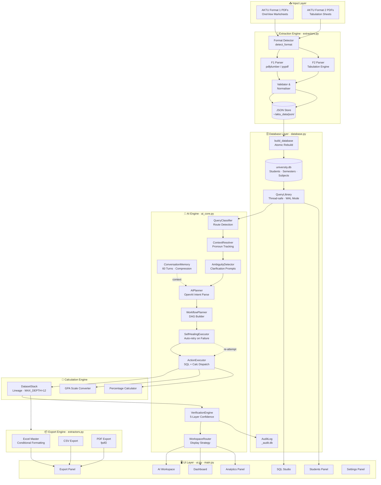

<div align="center">


<br/>


<br/><br/>

[](https://python.org)
[](https://sqlite.org)
[](https://openai.com)
[](https://langchain.com)
[](https://docs.python.org/3/library/tkinter.html)

[](LICENSE)
[]()
[]()
[]()

<br/>

> **Turn fragmented examination records into a live intelligence layer.**  
> AcadLib is a production-grade desktop application that ingests raw AKTU result PDFs,  
> builds a fully-indexed relational database, and exposes that data through  
> natural language, raw SQL, verified analytics, and exportable reports —  
> all without writing a single line of code.

<br/>

</div>

---

## 📖 Table of Contents

<details>
<summary><b>Click to expand full table of contents</b></summary>

- [🌟 Why AcadLib?](#-why-acadlib)
- [🎬 Feature Tour](#-feature-tour)
- [🏗 System Architecture](#-system-architecture)
- [🤖 The AI Engine — Deep Dive](#-the-ai-engine--deep-dive)
  - [Query Classifier](#1-queryclassifier)
  - [AI Planner](#2-aiplanner)
  - [Context Resolver](#3-contextresolver)
  - [Self-Healing Executor](#4-selfhealingexecutor)
  - [Verification Engine](#5-verificationengine)
  - [Conversation Memory](#6-conversationmemory)
  - [Ambiguity Detector](#7-ambiguitydetector)
  - [Workspace Router](#8-workspacerouter)
  - [Audit Log](#9-auditlog)
- [🗄 Database Design](#-database-design)
- [📥 PDF Extraction Engine](#-pdf-extraction-engine)
- [📊 Analytics & Export](#-analytics--export)
- [💬 Real Query Examples](#-real-query-examples)
- [🔄 Workflow Walkthroughs](#-workflow-walkthroughs)
- [⚙️ Configuration & Settings](#️-configuration--settings)
- [🚀 Quick Start](#-quick-start)
- [📁 Project Structure](#-project-structure)
- [📦 Technology Stack](#-technology-stack)
- [📈 Roadmap](#-roadmap)
- [🤝 Contributing](#-contributing)
- [👨‍💻 Author](#-author)

</details>

---

## 🌟 Why AcadLib?

Every semester, universities produce thousands of result records — buried in PDFs, locked inside examination portals, or scattered across spreadsheets. Querying this data means manual effort, fragile Excel formulas, or expensive proprietary systems.

**AcadLib changes that entirely.**

| Traditional Workflow | AcadLib Workflow |
|---|---|
| Download PDFs manually | Upload PDFs once — extraction is automatic |
| Build Excel pivot tables | Ask: *"Show branch-wise CGPA comparison"* |
| Write SQL by hand | Natural language → verified SQL → results |
| Static reports | Live dataset with lineage tracking |
| No audit trail | Every query logged with confidence score |
| Re-generate reports each semester | Incremental update from new PDFs |
| Siloed data, no verification | Self-healing queries + 5-layer verification |

---

## 🎬 Feature Tour

<details open>
<summary><b>📥 Dual-Format PDF Extraction Engine</b></summary>

Automatically detects and parses both AKTU examination formats:

- **Format 1** — AKTU OneView (individual student marksheets with semester blocks, pdfplumber/pypdf)
- **Format 2** — AKTU Tabulation (batch result sheets with CP notation, back-paper tracking)

Both pipelines extract: student identity, semester records, subject-level marks, SGPA, CGPA, pass/fail status, back-paper flags, and date of declaration.

</details>

<details>
<summary><b>🗄 Indexed Relational Database</b></summary>

Ingested data lives in an enterprise-grade SQLite database with:
- WAL journal mode for concurrent read/write safety
- `PRAGMA synchronous=NORMAL` for performance
- Thread-safe connection pooling via `threading.RLock`
- 7 custom indexes on hot query paths (name, CGPA, grade, roll number, semester)
- Foreign key integrity enforced
- Atomic swap on rebuild (`.tmp` → rename; never corrupts existing DB)
- Pre-computed `cgpa`, `failed_subjects`, `semesters_completed` on the `students` table

</details>

<details>
<summary><b>🤖 AI Workspace (Conversational Academic Copilot)</b></summary>

Ask questions in plain English. The orchestrator routes each query through a multi-stage pipeline:

```
User Query
  → Schema Validation
    → Ambiguity Detection
      → Context Resolution (pronoun tracking)
        → AI Planning (OpenAI)
          → Self-Healing Execution
            → 5-Layer Verification
              → Workspace Routing
                → Audit Log
```

Conversation memory compresses at 20 turns and supports up to 60 turns per session.

</details>

<details>
<summary><b>🧠 SQL Studio</b></summary>

Full SQL exploration with AI-assisted query generation via LangChain's `create_sql_agent`. Schema injection into the agent's system prompt prevents hallucinated column names. Supports up to `max_iterations=15` with OpenAI Tools or Tool Calling agent types.

</details>

<details>
<summary><b>📊 Analytics Engine</b></summary>

- **Rankings**: SGPA-per-semester, CGPA across all students, with `RANK() OVER (ORDER BY ...)` window functions
- **Branch Intelligence**: `GROUP BY branch` with avg/max CGPA
- **Fail Analysis**: Semester-level and cumulative, with `GROUP_CONCAT` of failed subject names
- **Grade Distribution**: Per-semester or global, across all subjects
- **Semester Trends**: Average, max, min SGPA per semester
- **GPA Conversion**: Configurable scale conversion (e.g., CGPA → 4.0 GPA)

</details>

<details>
<summary><b>✅ Verification Engine</b></summary>

Every result is validated across 5 axes before display:
1. **Dataset Validation** — rows present and non-empty
2. **Order Validation** — SGPA/CGPA sorted correctly
3. **Count Validation** — rows match expected totals
4. **Context Validation** — pronoun resolution succeeded
5. **Route Validation** — AI key available if AI route selected

Confidence is computed mathematically and displayed as a badge: `🟢 95%`, `🟡 72%`, or `🔴 44%`.

</details>

<details>
<summary><b>📦 Export Engine</b></summary>

- **Excel Master Report**: Full student × semester × subject join with conditional cell formatting (grade colors, CGPA-tiered fonts, auto-filter, freeze panes)
- **CSV**: Pandas-powered flat export
- **PDF**: Column-width auto-calculated, header row, row-by-row rendering via fpdf2

</details>

<details>
<summary><b>🔍 Audit & Observability</b></summary>

A dedicated `_audit.db` records every query with: timestamp, route, execution time (ms), rows returned, workspace used, confidence score, and error text. Query `audit_log.recent()` or `audit_log.stats()` for observability dashboards.

</details>

---

## 🏗 System Architecture



---

## 🤖 The AI Engine — Deep Dive

The AI system in `ai_core.py` is composed of **nine distinct, composable components**, each with a defined responsibility. This is not a monolithic chatbot — it is a multi-agent orchestration system.

```
EnterpriseOrchestrator
├── QueryClassifier         — intent routing
├── ContextResolver         — pronoun & dataset resolution
├── AmbiguityDetector       — disambiguation before execution
├── AIPlanner               — OpenAI-powered intent parsing
├── MultiStepWorkflowPlanner— DAG of steps from intent list
├── SelfHealingExecutor     — wraps ActionExecutor w/ retry
│   └── ActionExecutor      — dispatches to SQL / Calc
├── CalculationEngine       — GPA / percentage transforms
├── VerificationEngine      — confidence scoring
├── WorkspaceRouter         — display strategy selection
├── ConversationMemory      — 60-turn rolling + compression
└── AuditLog                — persistent observability
```

### 1. `QueryClassifier`

Routes each query to one of three processing pipelines:
- `rule_based` — direct keyword match (fast, no API call)
- `hybrid` — rule match + LLM verification
- `smart_ai` — full OpenAI planning pass

### 2. `AIPlanner`

Calls OpenAI with a structured prompt containing: recent conversation context (last 4 turns), current workflow state (`last_name`, `last_sem`), and action schema. Returns a JSON plan:

```json
{
  "message": "Fetching top 10 students in Semester 5...",
  "actions": [
    { "type": "query_topper", "params": { "semester": 5, "limit": 10 } }
  ]
}
```

### 3. `ContextResolver`

Tracks pronouns (`their`, `them`, `those students`, `previous result`, etc.) across turns. If a query references a prior result set, the resolver injects those rows without re-querying the database — enabling chains like:

```
"Show top 10 in Semester 3"
→ "Convert their GPA to 4.0 scale"   ← resolved from previous dataset
→ "Export this report"               ← resolved from current workspace
```

### 4. `SelfHealingExecutor`

Wraps `ActionExecutor` in a retry loop. On failure, it mutates action parameters (e.g., relaxes filters, falls back to a broader query) and re-attempts. Tracks `healed: bool` and `attempts: int` — both fed into the confidence penalty formula:

```python
if report.healed:     confidence -= 0.05
if report.attempts > 2: confidence -= 0.05
if report.error:      confidence  = confidence * 0.30
```

### 5. `VerificationEngine`

Returns a confidence score between `0.0` and `1.0` after validating:
- Row count vs. expected total
- Sort order correctness (SGPA/CGPA descending)
- Context resolution success
- Route availability (AI key present?)
- Calculation correctness flag

**Badge system:**

| Score | Badge |
|---|---|
| ≥ 90% | `🟢 95%` |
| ≥ 70% | `🟡 74%` |
| < 70% | `🔴 44%` |

### 6. `ConversationMemory`

Maintains a rolling window of 60 turns. At every 20-turn boundary, the oldest window is compressed into a summary string:

```
[3 queries: show top 10, convert gpa, export report; actions: query_topper, convert_scale, export_excel]
```

Also tracks `workflow_success_rate()` across all workflows in the session.

### 7. `AmbiguityDetector`

Intercepts queries that could have multiple valid interpretations and asks the user a targeted clarifying question before any SQL is executed. This prevents silent misdirection.

### 8. `WorkspaceRouter`

Decides how results are displayed based on dataset size and action type:
- `chat_inline` — small results, formatted directly in chat
- `mini_workspace` — medium results, rendered in a mini table
- `full_workspace` — large datasets, opened in the main workspace panel

### 9. `AuditLog`

Every `orchestrator.run()` call writes a record to `_audit.db`:

```sql
SELECT timestamp, query, route, execution_ms, rows_returned,
       workspace_used, confidence, status
FROM audit_log
ORDER BY id DESC LIMIT 20;
```

---

## 🗄 Database Design

```sql
-- students — core identity + pre-computed aggregates
CREATE TABLE students (
    id                  INTEGER PRIMARY KEY,
    name                TEXT COLLATE NOCASE,
    roll_number         TEXT UNIQUE,
    enrollment_number   TEXT,
    institute_code      TEXT,
    institute_name      TEXT COLLATE NOCASE,
    course              TEXT,
    branch              TEXT COLLATE NOCASE,
    gender              TEXT,
    father_name         TEXT COLLATE NOCASE,
    source_file         TEXT,
    cgpa                REAL,          -- pre-computed average of all SGPAs
    semesters_completed INTEGER,       -- count of semesters with valid SGPA
    failed_subjects     INTEGER        -- cumulative F/E/E# across all semesters
);

-- semesters — one row per student × semester
CREATE TABLE semesters (
    id                  INTEGER PRIMARY KEY,
    student_id          INTEGER,
    semester_number     INTEGER,
    even_odd            TEXT,
    session             TEXT,
    sgpa                REAL,
    total_marks_obtained REAL,
    result_status       TEXT,
    date_of_declaration TEXT,
    total_subjects      INTEGER,
    theory_subjects     INTEGER,
    practical_subjects  INTEGER,
    FOREIGN KEY(student_id) REFERENCES students(id)
);

-- subjects — granular marks and grades
CREATE TABLE subjects (
    id                  INTEGER PRIMARY KEY,
    semester_id         INTEGER,
    subject_code        TEXT COLLATE NOCASE,
    subject_name        TEXT COLLATE NOCASE,
    subject_type        TEXT,         -- Theory / Practical / CA
    internal_marks      REAL,
    external_marks      REAL,
    total_marks         REAL,
    back_paper_marks    REAL,
    grade               TEXT,         -- A+, A, B+, B, C, D, E, E#, F
    FOREIGN KEY(semester_id) REFERENCES semesters(id)
);
```

**Indexes** — 7 targeted indexes on `name`, `cgpa`, `failed_subjects`, `grade`, `semester_number`, `student_id`, `semester_id` ensure sub-millisecond lookups on large datasets.

**Grade Color Map:**

| Grade | Color | Meaning |
|---|---|---|
| `A+` | 🟢 `#3FB950` | Outstanding |
| `A` | 🟢 `#56D364` | Excellent |
| `B+` | 🔵 `#388BFD` | Very Good |
| `B` | 🔵 `#79C0FF` | Good |
| `C` | 🟡 `#E3B341` | Average |
| `D` | 🟡 `#D29922` | Below Average |
| `E` | 🔴 `#F85149` | Fail |
| `E#` | 🔴 `#DA3633` | Fail (Back Paper) |
| `F` | 🔴 `#8B0000` | Absent / Detained |

---

## 📥 PDF Extraction Engine

The extraction pipeline lives in `extractors.py` and follows a **detect → parse → validate → persist** pattern.

### Format Detection

```python
def detect_format(text: str) -> str:
    if "ONEVIEW" in text.upper(): return "aktu_f1"
    if "TABULATION" in text.upper(): return "aktu_f2"
    return "unknown"
```

### Format 1 — AKTU OneView

Uses `pdfplumber` (with `pypdf` fallback) to extract full-page text. A compiled regex parses subject rows:

```
SUBJECT_RE_F1 = r'^([A-Z]{2,5}\d{3,4}[A-Z]?)\s+(.*?)\s+(Theory|Practical|CA)\s+...'
```

Semester blocks are split by `Semester: N  Even/Odd: Odd|Even` markers. Each block yields: semester number, SGPA, session, date of declaration, and a list of subject records.

### Format 2 — AKTU Tabulation

Batch sheet format. Reads column headers to extract all subject codes, names, and types at the document level, then parses one row per student, extracting roll number, marks, grades, back-paper flags, and CP (credit point) count.

### Merge / Update Logic

When Format 2 data is uploaded for students already in the JSON store, `run_format2_update` performs an intelligent merge:
- `updated` — student exists, new semester added
- `skipped` — semester already present with matching SGPA
- `conflict` — semester present but SGPA differs (flagged for review)
- `created` — new student, new JSON file created

---

## 📊 Analytics & Export

### Built-in Query Library

All analytics queries live in `QueryLibrary` with named methods, preventing ad-hoc SQL construction:

```python
qlib.rank_students_by_sgpa(semester=5, limit=10)
qlib.rank_students_by_cgpa(limit=20)
qlib.get_fail_report_semester(semester=3)
qlib.grade_distribution(semester=5)
qlib.branch_stats()
qlib.all_semester_stats()
```

### GPA / Percentage Conversion

The `CalculationEngine` converts any numeric column in the active dataset:

```python
# Detected from query text:
# "convert to percentage"       → {"type": "percentage"}
# "convert to 4.0 scale"        → {"type": "scale", "target_scale": 4.0}
# "convert to GPA 10"           → {"type": "scale", "target_scale": 10.0}
```

Conversion is applied to the current `DatasetStack` top frame and pushed as a new provenance entry.

### Dataset Provenance Chain

Every transformation is tracked:

```
[+2 earlier] → all_students(542) → query_topper(10) → convert_scale(10)
```

The `DatasetStack` (max depth: 12) prevents unbounded memory growth via a 150-row in-memory cap per entry, while the UI retains the full dataset reference.

### Excel Master Report

The `to_excel_master` export generates a single `Master Records` sheet with:
- 21 columns (Rank → Grade)
- Conditional row fills: red for fail grades, yellow for back papers, zebra striping otherwise
- Per-cell font color logic for CGPA (green ≥ 8.0, blue ≥ 6.5, orange otherwise)
- Per-cell grade color from `GRADE_CLR` map
- Freeze pane at row 2, auto-filter on all 21 columns
- Calibri font, thin borders on every cell

---

## 💬 Real Query Examples

The AI Workspace understands a wide range of academic queries. Here are real examples, with their resolved action types:

| Query | Action Type | Route |
|---|---|---|
| `Show topper semester 5` | `query_topper` | `rule_based` |
| `Top 20 students by CGPA` | `cgpa_rankings` | `rule_based` |
| `Show fail report semester 3` | `fail_report` | `rule_based` |
| `Which branch has the highest average CGPA?` | `branch_stats` | `hybrid` |
| `Show Rahul's marks in semester 2` | `subject_detail` | `rule_based` |
| `Convert their GPA to 4.0 scale` | `convert_scale` | `rule_based` + context |
| `Grade distribution in semester 4` | `grade_distribution` | `rule_based` |
| `Compare semester-wise performance` | `semester_stats` | `rule_based` |
| `Export current report to Excel` | `export_excel` | `rule_based` |
| `How many students failed more than 3 subjects?` | `smart_sql` | `smart_ai` |
| `Show students with CGPA above 8.5 in CS branch` | `smart_sql` | `smart_ai` |
| `Which subject has the highest failure rate?` | `smart_sql` | `smart_ai` |

---

## 🔄 Workflow Walkthroughs

### Workflow A — Ranked Report with Scale Conversion

```
User:  "Show top 10 students in semester 5"
       ↓ QueryClassifier → rule_based
       ↓ AIPlanner → query_topper(semester=5, limit=10)
       ↓ ActionExecutor → rank_students_by_sgpa(5, 10)
       ↓ DatasetStack.push(10 rows, "query_topper")
       ↓ VerificationEngine → check sort order, count
Bot:   🟢 92% — Top 10 displayed in workspace

User:  "Convert their CGPA to 4.0 GPA scale"
       ↓ ContextResolver → pronoun "their" → resolves to previous 10 rows
       ↓ _inject_conversion → adds convert_gpa4=True
       ↓ CalculationEngine → applies (cgpa/10)*4.0 per row
       ↓ DatasetStack.push(10 rows, "convert_scale")
       ↓ Provenance: query_topper(10) → convert_scale(10)
Bot:   🟢 88% — GPA 4.0 column added

User:  "Export this report"
       ↓ ContextResolver → "this" → last_exportable_dataset
       ↓ ActionExecutor → export_excel → DataExporter.to_excel(...)
Bot:   ✅ Export complete → top_10_sem5_gpa4.xlsx
```

### Workflow B — Fail Analysis

```
User:  "Generate fail report for semester 3"
       ↓ get_fail_report_semester(3)
       ↓ Returns: name, roll, branch, failed_count, failed_subjects (GROUP_CONCAT)
       ↓ VerificationEngine → rows > 0, not empty
Bot:   🟢 91% — Fail report opened in workspace

User:  "How many students failed more than 2 subjects?"
       ↓ smart_ai route → LangChain SQL Agent
       ↓ Schema injection prevents hallucination
       ↓ Agent generates: SELECT COUNT(*) FROM students WHERE failed_subjects > 2
Bot:   🟢 88% — "47 students failed more than 2 subjects"
```

---

## ⚙️ Configuration & Settings

AcadLib stores all user configuration at `~/aktu_data/settings.json`:

```json
{
  "json_dir":    "~/aktu_data/json",
  "db_path":     "~/aktu_data/university.db",
  "export_dir":  "~/aktu_data/exports",
  "openai_key":  "sk-...",
  "model":       "gpt-4o-mini"
}
```

| Setting | Default | Description |
|---|---|---|
| `json_dir` | `~/aktu_data/json` | Directory for extracted student JSON files |
| `db_path` | `~/aktu_data/university.db` | SQLite database path |
| `export_dir` | `~/aktu_data/exports` | Output directory for Excel/CSV/PDF |
| `openai_key` | `""` | OpenAI API key (required for AI Workspace) |
| `model` | `gpt-4o-mini` | OpenAI model for intent parsing and SQL Agent |

> **No API key?** The system gracefully degrades. Rule-based queries, SQL Studio, Analytics, and Export all function without OpenAI. Only the `smart_ai` route and SQL Agent require a key.

---

## 🚀 Quick Start

### Prerequisites

```bash
python --version  # 3.10 or higher required
```

### 1. Clone

```bash
git clone https://github.com/NIKHILUTTAM/AcadLib.git
cd AcadLib
```

### 2. Install Dependencies

```bash
pip install pdfplumber pypdf openpyxl pandas fpdf2 \
            langchain langchain-community langchain-openai \
            openai
```

### 3. Configure API Key (Optional)

```bash
# Windows
set OPENAI_API_KEY=sk-your-key-here

# Linux / macOS
export OPENAI_API_KEY=sk-your-key-here
```

Or set it directly inside the app via the **Settings** panel.

### 4. Run

```bash
python main.py
```

### 5. First-Time Setup

1. Navigate to **Upload F1** → select your AKTU OneView PDFs → click Extract
2. Navigate to **Database** → click **Rebuild Database**
3. Navigate to **AI Workspace** → type your first query
4. (Optional) Navigate to **Settings** → paste your OpenAI API key → enable SQL Agent

---

## 📁 Project Structure

```text
AcadLib/
│
├── main.py              # App entry point — Tkinter root, panel routing, event bindings
│
├── config.py            # AppState (settings, DB init, agent init), theme constants,
│                        # font definitions, grade colors, rotating file logger
│
├── ai_core.py           # Full AI orchestration system:
│   ├── ConversationMemory       (60 turns, auto-compression)
│   ├── WorkflowStateManager     (DatasetStack, context tracking)
│   ├── ContextResolver          (pronoun + dataset resolution)
│   ├── CalculationEngine        (GPA / percentage transforms)
│   ├── QueryClassifier          (route detection)
│   ├── AIPlanner                (OpenAI intent parsing)
│   ├── ActionExecutor           (SQL + calculation dispatch)
│   ├── SelfHealingExecutor      (retry wrapper)
│   ├── VerificationEngine       (5-layer confidence scoring)
│   ├── SchemaValidator          (pre-flight column validation)
│   ├── AmbiguityDetector        (clarification prompts)
│   ├── WorkspaceRouter          (display strategy)
│   ├── MultiStepWorkflowPlanner (DAG builder)
│   ├── EnterpriseOrchestrator   (top-level run loop)
│   └── EvaluationRunner         (offline test harness)
│
├── database.py          # SQLite layer:
│   ├── build_database   (atomic JSON → SQLite pipeline)
│   ├── QueryLibrary     (thread-safe, named query methods)
│   └── AuditLog         (per-query observability DB)
│
├── extractors.py        # PDF processing & export:
│   ├── detect_format
│   ├── parse_student_header_f1 / parse_subjects_f1 / split_semesters_f1
│   ├── parse_format2_pdf / parse_student_block_f2 / run_format2_update
│   └── DataExporter     (CSV / Excel simple / Excel master / PDF)
│
├── models.py            # Data models:
│   ├── SubjectRecord, SemesterRecord, StudentRecord
│   ├── DatasetStack     (provenance chain, MAX_DEPTH=12)
│   ├── DatasetEntry / DatasetProvenance
│   ├── ResultMeta       (truncation / overflow detection)
│   ├── ExecutionReport  (confidence, badge, route tracking)
│   └── WorkflowStep
│
├── ui.py                # All Tkinter panels:
│   ├── Sidebar, apply_theme
│   ├── DashboardPanel, StudentsPanel, AnalyticsPanel
│   ├── UploadF1Panel, UploadF2Panel, DatabasePanel
│   ├── ChatbotPanel, SQLAgentPanel
│   ├── ExportPanel, SettingsPanel
│
└── __init__.py          # Package exports
```

---

## 📦 Technology Stack

| Layer | Technology | Purpose |
|---|---|---|
| **Language** | Python 3.10+ | Core runtime |
| **GUI** | Tkinter + ttk | Native desktop UI, dark theme |
| **Database** | SQLite (WAL mode) | Academic knowledge base |
| **PDF Extraction** | pdfplumber / pypdf | Text extraction from AKTU PDFs |
| **AI Planning** | OpenAI API (GPT-4o-mini) | Natural language intent parsing |
| **SQL Agent** | LangChain + langchain-openai | Conversational SQL generation |
| **Concurrency** | threading.RLock | Thread-safe DB access |
| **Data Export** | openpyxl, pandas, fpdf2 | Excel / CSV / PDF generation |
| **Logging** | RotatingFileHandler | 5 MB rolling log, 3 backups |
| **Observability** | SQLite AuditLog | Per-query metrics and history |

---

## 📈 Roadmap

### Near-Term
- [ ] Dynamic template builder for non-AKTU universities
- [ ] Multi-university format support
- [ ] Visual Format Designer for custom PDF layouts
- [ ] Student success prediction (semester-over-semester trend)

### Enterprise Features
- [ ] Role-based access control (Admin / Analyst / Viewer)
- [ ] Multi-user session isolation
- [ ] REST API layer over the query library
- [ ] Cloud synchronization (SQLite → PostgreSQL)
- [ ] Institution-level dashboards

### AI Improvements
- [ ] Local LLM support (Ollama) for air-gapped deployments
- [ ] Academic performance forecasting (CGPA trend extrapolation)
- [ ] Anomaly detection (outlier grade patterns)
- [ ] AI Academic Advisor (student-facing report generation)

### Evaluation
- [ ] Offline test harness (`EvaluationRunner`) with a full benchmark suite
- [ ] CI integration for query classification accuracy (`QueryClassifier`)
- [ ] Planner accuracy regression tests (`AIPlanner`)

---

## 🤝 Contributing

Pull requests are welcome. For major changes, please open an issue first to discuss the proposed change.

```bash
# Fork the repo
# Create your feature branch
git checkout -b feature/your-feature-name

# Commit your changes
git commit -m "feat: description of what you added"

# Push and open a PR
git push origin feature/your-feature-name
```

Please ensure any new `QueryLibrary` methods use the `_run()` helper (thread-safe) and that any new AI actions are covered by a test case in `tests/ai_queries.json`.

---

## 👨‍💻 Author

<div align="center">


[](https://github.com/NIKHILUTTAM)

**Areas of Expertise:**  
Agentic AI Systems · Academic Analytics · Data Intelligence · Enterprise Desktop Applications

</div>

---

<div align="center">


**Built with Python · SQLite · OpenAI · LangChain · Academic Intelligence**

*AcadLib — Because academic data deserves better than spreadsheets.*

⭐ **Star this repo** if AcadLib saved you from another Excel pivot table.

</div>